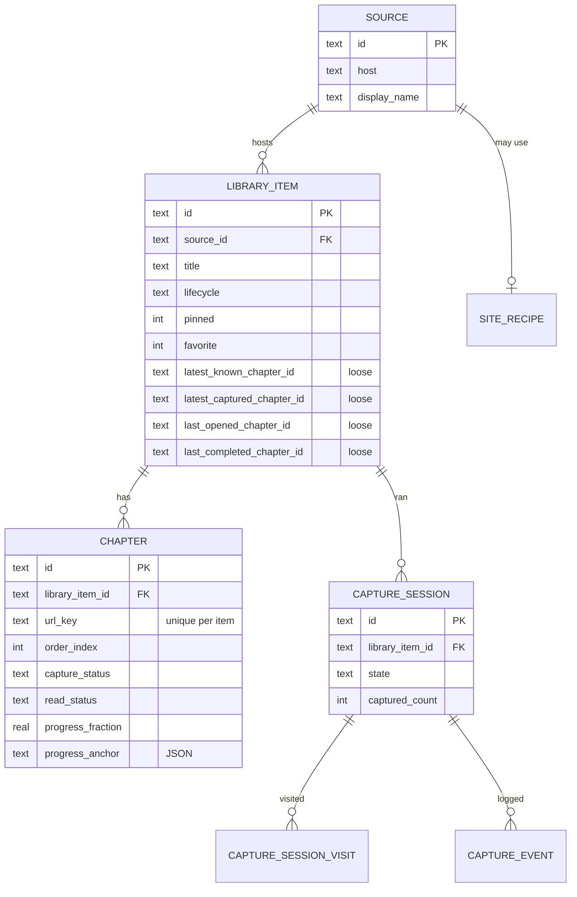

# Web Reader — Data Model

> Entities, statuses, tables, indexes, and the chapter manifest.
> Terminology is defined in [PRODUCT.md](./PRODUCT.md) §2. Storage rationale is in
> [TECHNICAL_SPEC.md](./TECHNICAL_SPEC.md) §10–11.
> Status: design sketch. The DDL below is illustrative — the real schema is generated by drift from
> Dart table classes. Column names and semantics here are what matters.

**Conventions**

- IDs are client-generated **UUID v4 strings**. Cheap now, and the precondition for any future sync.
- Timestamps are **INTEGER Unix milliseconds, UTC**. No local-time storage anywhere.
- Booleans are `INTEGER` 0/1.
- Paths are **relative to `webread/`**. Never absolute — see [TECHNICAL_SPEC.md](./TECHNICAL_SPEC.md) §11.
- Enums are stored as `TEXT` with the exact camelCase spellings listed in §3–§5.

---

## 1. Entities



| Entity | Rows, roughly | Purpose |
|---|---|---|
| `source` | tens | A website. Groups items, holds the future per-site recipe link. |
| `library_item` | tens–hundreds | The durable tracked unit. Survives everything. |
| `chapter` | thousands | One unit of content. Known and/or captured and/or read. |
| `capture_session` | hundreds | One autonomous run; the recovery record. |
| `capture_session_visit` | thousands | Loop detection within a session. |
| `capture_event` | bounded | Diagnostics. Rotated. |
| `site_recipe` | tens | **Reserved.** Schema defined, not used in the MVP. |

**The loose-link rule:** the four pointer columns on `library_item` hold chapter IDs but declare **no
foreign key**. A real FK would create a cycle with `chapter.library_item_id` and would make delete
ordering fragile. They are nullable, validated by
`LibraryRepository.repairPointers()`, and a dangling pointer degrades to "no pointer", never to a
crash. `chapter.library_item_id` **is** a real FK with `ON DELETE CASCADE` — deleting an item really
does delete its chapters, and that is the only cascade in the schema.

---

## 2. Field reference

### 2.1 `source`

| Column | Type | Notes |
|---|---|---|
| `id` | TEXT PK | |
| `host` | TEXT NOT NULL UNIQUE | Registrable-domain-normalised host, lowercase |
| `display_name` | TEXT | From `og:site_name` or the title, editable |
| `favicon_path` | TEXT | Relative |
| `recipe_id` | TEXT | Reserved; null in MVP |
| `created_at` | INTEGER NOT NULL | |

### 2.2 `library_item`

| Column | Type | Notes |
|---|---|---|
| `id` | TEXT PK | |
| `source_id` | TEXT NOT NULL FK → `source.id` | |
| `title` | TEXT NOT NULL | User-editable; seeded from the page |
| `source_url` | TEXT NOT NULL | Series/index page, else the first captured chapter |
| `source_url_key` | TEXT NOT NULL UNIQUE | Normalised (§6). Prevents adding the same series twice |
| `canonical_url` | TEXT | From `<link rel=canonical>` when present |
| `content_type` | TEXT NOT NULL | `webtoon` \| `text` \| `mixed` \| `unknown` |
| `cover_path` | TEXT | Relative |
| `lifecycle` | TEXT NOT NULL DEFAULT `'active'` | `active` \| `dormant` \| `archived`. **As built (schema v7, M16):** `active` \| `archived` only, plus an `archived_at` timestamp; `dormant` arrives with M9 |
| `lifecycle_before_archive` | TEXT | Restores the previous state on un-archive. **Not built yet** — only needed once `dormant` exists (M9) |
| `pinned` | INTEGER NOT NULL DEFAULT 0 | |
| `pinned_order` | REAL | Fractional index (§7). Null when unpinned |
| `favorite` | INTEGER NOT NULL DEFAULT 0 | |
| `added_at` | INTEGER NOT NULL | |
| `archived_at` | INTEGER | |
| `last_opened_at` | INTEGER | Reader opened anything in this item |
| `last_read_at` | INTEGER | Reading progress advanced. Drives Recently Read |
| `source_updated_at` | INTEGER | When a *new* chapter was last discovered |
| `latest_known_chapter_id` | TEXT (loose) | §5 |
| `latest_captured_chapter_id` | TEXT (loose) | §5 |
| `last_opened_chapter_id` | TEXT (loose) | §5 |
| `last_completed_chapter_id` | TEXT (loose) | §5 |
| `last_check_ok_at` | INTEGER | Last **successful** update check |
| `last_check_failed_at` | INTEGER | Last **failed** update check |
| `last_check_error` | TEXT | Redacted message |
| `last_check_quality` | TEXT | `complete` \| `partial` \| `failed` — see [TECHNICAL_SPEC.md](./TECHNICAL_SPEC.md) §9 |
| `notes` | TEXT | User notes |

`last_check_ok_at` and `last_check_failed_at` are **both** kept. A failure must not erase the memory
of the last success — otherwise "last checked" silently becomes a lie after one network blip.

### 2.3 `chapter`

| Column | Type | Notes |
|---|---|---|
| `id` | TEXT PK | |
| `library_item_id` | TEXT NOT NULL FK → `library_item.id` ON DELETE CASCADE | |
| `source_url` | TEXT NOT NULL | As visited |
| `url_key` | TEXT NOT NULL | Normalised (§6). `UNIQUE(library_item_id, url_key)` |
| `canonical_url` | TEXT | Secondary identity signal (§6.2) |
| `title` | TEXT | |
| `number` | REAL | Parsed chapter number; `REAL` so `12.5` works. Nullable |
| `order_index` | INTEGER NOT NULL | Authoritative ordering (§9) |
| `content_type` | TEXT | `webtoon` \| `text` |
| `discovered_at` | INTEGER NOT NULL | |
| `discovered_via` | TEXT NOT NULL | `capture` \| `updateCheck` \| `manual` |
| `capture_status` | TEXT NOT NULL DEFAULT `'notCaptured'` | §3 |
| `offline_removed_at` | INTEGER | **As built (v9)** — this sketch's `content_deleted_at` under the name the code uses. When the USER removed this chapter's offline files; distinct from `content_missing_at` (files the system lost). Renders as "Not available offline — capture again", never as an error. Cleared explicitly on re-capture, because drift's upsert leaves nulls alone |
| `capture_started_at` | INTEGER | |
| `captured_at` | INTEGER | |
| `capture_attempts` | INTEGER NOT NULL DEFAULT 0 | |
| `capture_error` | TEXT | Redacted message |
| `capture_error_class` | TEXT | The taxonomy key from [TECHNICAL_SPEC.md](./TECHNICAL_SPEC.md) §13.1 |
| `capture_version` | INTEGER | Bridge/extractor version that produced it |
| `content_path` | TEXT | Relative chapter directory |
| `asset_count` | INTEGER | |
| `byte_size` | INTEGER | For the storage screen |
| `content_hash` | TEXT | SHA-256 over ordered asset hashes, or over normalised text |
| `content_deleted_at` | INTEGER | User freed space. Row and history stay. **Built as `offline_removed_at` (v9)** — same concept, see above |
| `content_missing_at` | INTEGER | Files vanished behind our back |
| `next_url` | TEXT | The next URL this page yielded — the capture chain, kept for diagnosis |
| `read_status` | TEXT NOT NULL DEFAULT `'unread'` | §4 |
| `progress_fraction` | REAL NOT NULL DEFAULT 0 | 0..1 |
| `progress_anchor` | TEXT | JSON — [TECHNICAL_SPEC.md](./TECHNICAL_SPEC.md) §12.1 |
| `first_opened_at` | INTEGER | |
| `last_read_at` | INTEGER | |
| `completed_at` | INTEGER | |

### 2.4 `capture_session`

> **As built:** the runtime table is `capture_jobs`. Schema v9 adds
> `pause_reason` — why a running job is held (`browserHidden` today, set when
> the user leaves the Browser mid-capture). It lets Activity say "paused —
> Browser required" instead of a bare "paused", survives a restart, and is
> cleared explicitly on resume (drift's upsert leaves nulls alone).

| Column | Type | Notes |
|---|---|---|
| `id` | TEXT PK | |
| `library_item_id` | TEXT (loose) | Null until `preparing` resolves the item |
| `start_url` | TEXT NOT NULL | |
| `limit_kind` | TEXT NOT NULL | `single` \| `count` \| `untilEnd` |
| `limit_value` | INTEGER | For `count` |
| `state` | TEXT NOT NULL | The state machine's state name |
| `state_reason` | TEXT | `limitReached` \| `endOfChain` \| `loopDetected` \| `consecutiveFailures` \| `storage` \| `interrupted` … |
| `current_url` | TEXT | Resume origin |
| `current_chapter_id` | TEXT (loose) | |
| `captured_count` | INTEGER NOT NULL DEFAULT 0 | |
| `failed_count` | INTEGER NOT NULL DEFAULT 0 | |
| `consecutive_failures` | INTEGER NOT NULL DEFAULT 0 | Reset by any success |
| `attempt` | INTEGER NOT NULL DEFAULT 0 | Current step's retry counter, for the UI |
| `created_at` / `updated_at` / `finished_at` | INTEGER | `updated_at` on every transition |
| `last_error` / `last_error_class` | TEXT | |

### 2.5 `capture_session_visit`

`(session_id, url_key)` composite PK, plus `chapter_id`, `visited_at`. The in-session visited set,
persisted so a resumed session does not re-walk pages it already handled.

### 2.6 `capture_event`

`id INTEGER PK AUTOINCREMENT`, `session_id`, `chapter_id`, `at`, `level`
(`debug`/`info`/`warn`/`error`), `state`, `code`, `message`, `data` (JSON).

**Bounded by construction:** keep at most 500 events per session and delete events for sessions
finished more than 7 days ago, swept at startup. A diagnostics table that grows forever is a bug.

### 2.7 `site_recipe` — reserved, not used in the MVP

`id`, `host_pattern`, `enabled`, `origin` (`builtin`/`user`), `content_selector`,
`image_selector`, `next_selector`, `title_selector`, `chapter_list_selector`, `flags` (JSON),
`created_at`, `updated_at`.

Defined now so that adding recipes later is a data change plus one extractor, not a schema migration
through live data.

---

## 3. Capture statuses

| Status | Meaning | Files on disk | Readable |
|---|---|---|---|
| `notCaptured` | Known to exist; no local content. Also the state after *Free up space* or an interrupted attempt | No | No |
| `queued` | Selected for capture in the current session | No | No |
| `capturing` | In flight | Staging only | No |
| `captured` | Committed and verified complete | Yes | **Yes** |
| `partial` | Committed but knowingly incomplete (infinite scroll, some assets failed) | Yes | Yes, with a banner |
| `failed` | The attempt failed; `capture_error_class` says why | No | No |

Transitions are one-directional per attempt: `notCaptured → queued → capturing → {captured | partial |
failed}`. A retry starts a **new** attempt from `notCaptured` with a fresh staging directory.
`capturing` never transitions to `captured` at startup — see [TECHNICAL_SPEC.md](./TECHNICAL_SPEC.md) §14.

---

## 4. Reading statuses

| Status | Meaning | Set by |
|---|---|---|
| `unread` | Never opened, or explicitly marked unread | Default; *Mark as unread* |
| `inProgress` | Opened, position recorded, not finished | Reader |
| `completed` | Finished — threshold reached, or explicitly marked | Reader / *Mark as read* |

- Opening a chapter sets `inProgress`, `first_opened_at` (once), and `last_read_at`. **It never sets
  `completed`.**
- **A completed chapter is 100%.** `progress_fraction` is forced to 1 whenever `read_status` is
  `completed` — on the dwell completion, on *Mark as read*, and on every progress save afterwards.
  Re-reading a finished chapter moves the *anchor* (so resuming still lands where the reader is) but
  never the fraction. Without this, re-opening a finished chapter and scrolling up reported it as 40%
  read. `readProgressFor()` applies the same rule on the display side, so rows written before it
  existed also read correctly; `ReadingRepository.repairCompletedProgress()` fixes them at boot.
- *Mark as unread* sets `unread`, clears `completed_at`, and **keeps the anchor** so the user can
  still resume. The fraction is reset to 0 when the chapter had been completed — completion had
  forced it to 1, and leaving it there would show a full bar on a chapter marked unread.
- Capturing a chapter never changes `read_status`. Discovering one never changes it either. Asserted
  in tests.

---

## 5. The four pointers

These are the most commonly confused fields in the model, so they are spelled out.

| Pointer | Question it answers | Advanced by | Never advanced by |
|---|---|---|---|
| `latest_known_chapter_id` | What is the newest chapter that *exists on the source*? | Discovery during capture, update check | Reading |
| `latest_captured_chapter_id` | What is the newest chapter I *have offline*? | A successful capture commit | Discovery, reading |
| `last_opened_chapter_id` | What did the user most recently *open*? | Reader open | Capture, discovery |
| `last_completed_chapter_id` | What is the newest chapter the user *finished*? | Completion rules, *Mark as read* | Opening, capture, discovery |

Worked example — a series with chapters 1–20 on the source, 1–15 captured, read through 12, currently
half-way through 13:

```
latest_known      = ch20      "20 exist"
latest_captured   = ch15      "15 are on the phone"
last_opened       = ch13      "reading 13 right now"
last_completed    = ch12      "12 is the last one finished"

-> Continue Reading:  ch13 at 50 %
-> New Chapters:      5 known but not captured (16–20)
-> Unread offline:    2 (14, 15)
```

Collapsing any two of these produces a specific, familiar bug: mark-on-download (capture advances
read state), phantom progress (opening counts as finishing), or a "new chapters" badge that clears
itself when you download without reading. Keep them separate.

Ordering comparisons between pointers use `order_index` (§9), never IDs and never timestamps.

---

## 6. URL normalisation and chapter identity

### 6.1 `url_key`

Chapter identity is the normalised URL, stored as a string (not a hash — a hash is undebuggable and
we gain nothing at this scale).

```
url_key(url):
  1. lowercase scheme and host; drop the default port
  2. drop the fragment
  3. drop tracking params: utm_*, fbclid, gclid, igshid, ref, source, _ga
  4. sort the remaining query params by key
  5. collapse duplicate slashes; strip a trailing slash unless the path is "/"
  6. percent-decode unreserved characters
```

Deliberately **not** normalised: `www.` is kept (stripping it can merge genuinely distinct hosts), and
the scheme is kept (`http` vs `https` are different origins for cookies). A per-recipe override can
relax either later.

`UNIQUE(library_item_id, url_key)` is what makes duplicate chapters impossible rather than merely
unlikely.

### 6.2 When URLs change

Three defences, in order:

1. **`canonical_url`** — if a newly visited page's canonical normalises to an existing chapter's
   `url_key` or `canonical_url`, it is the same chapter. Update `source_url`, do not insert.
2. **`content_hash`** — if the extracted content hashes identically to an existing chapter, it is the
   same chapter (and, mid-session, a loop signal).
3. **Manual** — if a site migrates domains, the user edits the item's `source_url`. Chapters keep
   their history; new chapters are discovered under the new host. `[Assumption]` this is rare enough
   that a manual fix is proportionate for the MVP. Automatic re-keying is a future feature (Q22).

---

## 7. Pin ordering

`pinned_order REAL`, sparse. New pins go to `max + 1.0`; a drag between two neighbours takes the
midpoint of their values. No renumbering pass, no cascading updates, and manual ordering is possible
the day the UI wants it — which is exactly what "the data model should not prevent it" requires.

Re-normalise to integers only if the gaps ever get pathologically small (a maintenance routine, not a
runtime concern).

`pinned` and `pinned_order` are independent of `lifecycle`. Archiving preserves both.

---

## 8. Queries and indexes

### 8.1 The counts CTE

Every library view that needs per-item counts reuses this shape:

```sql
WITH counts AS (
  SELECT library_item_id,
         SUM(capture_status <> 'captured')                                  AS uncaptured_known,
         SUM(read_status = 'unread')                                        AS unread_known,
         SUM(read_status = 'unread' AND capture_status = 'captured')        AS unread_offline,
         SUM(capture_status IN ('failed','partial'))                        AS problem_chapters,
         SUM(capture_status = 'captured')                                   AS offline_chapters
  FROM chapter
  GROUP BY library_item_id
)
```

These counts are **derived, never stored**. Denormalised counters drift out of sync with reality after
exactly one edge case; with the indexes below the aggregate is trivially fast at our row counts.
(The four *pointers* are denormalised because they are user state, not aggregates — §5.)

### 8.2 Continue Reading

```sql
SELECT i.*
FROM library_item i
WHERE i.lifecycle = 'active'
  AND ( EXISTS (SELECT 1 FROM chapter c
                WHERE c.library_item_id = i.id AND c.read_status = 'inProgress')
     OR ( i.last_opened_at IS NOT NULL
          AND EXISTS (SELECT 1 FROM chapter c
                      WHERE c.library_item_id = i.id
                        AND c.read_status = 'unread'
                        AND c.capture_status = 'captured') ) )
ORDER BY i.pinned DESC, i.last_read_at DESC
LIMIT 20;
```

"Unfinished" means either mid-chapter, or finished a chapter with the next one already downloaded.
An item that was never opened is **not** Continue Reading — it belongs to New Chapters.

### 8.3 Recently Read

```sql
SELECT * FROM library_item
WHERE last_read_at IS NOT NULL AND lifecycle <> 'archived'
ORDER BY last_read_at DESC LIMIT 30;
```

### 8.4 Pinned

```sql
SELECT * FROM library_item
WHERE pinned = 1 AND lifecycle <> 'archived'
ORDER BY pinned_order ASC, added_at ASC;
```

### 8.5 New Chapters

```sql
SELECT i.*, c.uncaptured_known, c.unread_known
FROM library_item i JOIN counts c ON c.library_item_id = i.id
WHERE i.lifecycle = 'active' AND c.uncaptured_known > 0
ORDER BY c.uncaptured_known DESC, i.source_updated_at DESC;
```

### 8.6 Indexes

| Index | Serves |
|---|---|
| `library_item(last_read_at DESC)` | Recently Read; the `ORDER BY` in Continue Reading |
| `library_item(lifecycle, last_read_at DESC)` | Continue Reading, Active Library |
| `library_item(pinned_order) WHERE pinned = 1` | Pinned (partial index — small and hot) |
| `library_item(lifecycle, title)` | Dormant, Archive, title sort |
| `library_item(added_at DESC)` | Recently Added |
| `library_item(source_url_key)` UNIQUE | Duplicate-add prevention |
| `chapter(library_item_id, url_key)` UNIQUE | Chapter identity — the load-bearing one |
| `chapter(library_item_id, order_index)` | Reader prev/next, chapter list, pointer comparisons |
| `chapter(library_item_id, capture_status)` | Counts CTE, New Chapters, offline availability |
| `chapter(library_item_id, read_status)` | Counts CTE, Continue Reading `EXISTS` |
| `chapter(url_key)` | Cross-item duplicate and loop lookups |
| `chapter(last_read_at DESC)` | "Recently read chapters" and pointer repair |
| `capture_session(state, updated_at DESC)` | Orphaned-session recovery, session history |
| `capture_event(session_id, id DESC)` | Log view, rotation sweep |

All of these are cheap: at a realistic ceiling of a few hundred items and tens of thousands of
chapters, the whole index set is a couple of megabytes.

---

## 9. Chapter ordering

`order_index` is authoritative, assigned as an increasing integer in the order chapters are
**encountered along the capture/discovery chain**. For a chapter-based site walked by next-links, that
chain *is* the reading order — more reliable than any parsed number.

`number` is a best-effort parse from the title or URL, used for display and for reconciling an update
check (a discovered chapter with `number = 21` slots after `number = 20`). When it is absent or
inconsistent, `order_index` still works.

**Discovery inserting into the middle:** an update check that finds chapters *before* the earliest
known one (a back-catalogue) assigns negative or fractional-then-renumbered indices. A single
`renumber(itemId)` routine sorts by `(number ?? order_index)` and rewrites `order_index` densely; it
runs after any out-of-order insert. Manual reordering by the user is a future feature; the model
already permits it.

---

## 10. Chapter manifest

`manifest.json` sits inside the chapter directory. It makes a chapter directory self-describing, which
is what lets §14 of the technical spec reconcile files against the database after a crash — and what
would let a future export or import work without the database at all.

```jsonc
{
  "schemaVersion": 1,
  "chapterId": "3f2a9c40-6b1e-4a55-9f3b-9c8a10c2d5e7",
  "libraryItemId": "8d1c7b22-4f0a-4d6e-9a71-2b5f6c9e1a03",

  "sourceUrl": "https://example.com/series/foo/chapter-42?utm_source=rss",
  "urlKey": "https://example.com/series/foo/chapter-42",
  "canonicalUrl": "https://example.com/series/foo/chapter-42",
  "nextUrl": "https://example.com/series/foo/chapter-43",

  "contentType": "webtoon",
  "seriesTitle": "Foo",
  "title": "Chapter 42 — The Long Wait",
  "chapterNumber": 42,
  "orderIndex": 42,

  "capturedAt": "2026-07-25T09:14:03.221Z",
  "captureVersion": 1,
  "status": "complete",              // complete | partial
  "statusReason": null,              // e.g. "infiniteScroll", "assetsFailed:2"

  "assets": [
    { "index": 1, "file": "assets/001.jpg", "sourceUrl": "https://cdn.example.com/a/1.jpg",
      "bytes": 184320, "width": 800, "height": 1240, "sha256": "9f86d0…" },
    { "index": 2, "file": "assets/002.jpg", "sourceUrl": "https://cdn.example.com/a/2.jpg",
      "bytes": 201114, "width": 800, "height": 1300, "sha256": "b1946a…" }
  ],
  "text": null,                       // { "html": "content.html", "txt": "content.txt", "chars": 18422 }
  "contentHash": "sha256:4a7d1ed4…"
}
```

Note the manifest timestamp is ISO-8601 while the database uses epoch millis: the manifest is a
portable, human-readable artefact; the database is an index. Assets are ordered by `index`, which is
**DOM order**, not filename order — filenames are just zero-padded sequence numbers.

---

## 10a. As-built reading state (M5, 2026-07-27)

The shipped schema differs from the design sketch above in one way worth
stating: reading state lives on the `chapters` row rather than in a separate
table, and the series pointers are denormalised onto `library_items`.

**`chapters` — reading columns**

| Column | Meaning |
|---|---|
| `read_status` | `unread` / `inProgress` / `completed` |
| `progress_fraction` | 0..1 through the chapter — the durable half of the position. **Always 1 when `read_status` is `completed`** |
| `progress_image_index` | Anchor: panel index at the top of the viewport |
| `progress_offset_in_image` | 0..1 down that panel |
| `first_opened_at`, `last_read_at`, `completed_at`, `progress_updated_at` | Timestamps |

**`library_items` — reading pointers**

`last_opened_chapter_id`, `last_completed_chapter_id`, `last_read_at`.
Derivable, but every library ordering query reads them, and recomputing a
per-series aggregate per row on every stream emission is the difference between
a snappy list and a stuttery one. Written in the same call as the chapter change
that causes them, and rebuildable by `ReadingRepository.repairSeriesReadingState()`.

Counts (unread, all-completed, next-unread) are **derived**, never stored —
counters drift the moment an edge case is missed.

### Position representation

Hybrid, and both halves are always written:

- **Anchor** (`progress_image_index` + `progress_offset_in_image`) restores the
  exact spot. It goes stale when a chapter is re-downloaded with a different
  panel count.
- **Fraction** is approximate but content-independent, so it always means
  something.

Restore prefers the anchor and falls back to the fraction when the panel no
longer exists. Panel heights come from the manifest's recorded dimensions, so
the list geometry is known before any image decodes — that is what lets the
reader open *at* the position instead of visibly jumping there.

Raw pixel offsets are never stored: they break on a width change, a re-download,
or a reader layout change.

### Completion

`read_status = completed` when the fraction passes **0.97** and stays there for
~800 ms, or on an explicit *Mark as read*. The threshold is short of 1.0 because
a trailing comments section or an over-tall final panel would otherwise make a
chapter impossible to finish; the dwell stops a fling to the bottom from
counting.

Opening never completes. *Mark as unread* clears `completed_at` and the status
but **keeps** the anchor and fraction — the user is saying it is unfinished, not
that they were never there.

### Capture and reading are separate

Capture code has no DAO method that can write a reading column
(`writeChapterReading` is the only path, and only `reading/` calls it). Re-capture
carries reading fields across verbatim, so a chapter can be re-downloaded and
stay exactly where the user was, still marked completed.

---

## 10b. As-built discovery, update checks, session decisions (schema v5, 2026-07-27)

Additive migration `4 → 5`; nothing dropped or retyped.

### Discovered chapters are `chapters` rows, not a new table

An update check that finds a chapter records it as an ordinary `chapters` row
with `capture_status = 'knownRemote'`, `content_path = NULL` and three new
columns: `discovered_at`, `discovery_basis` (`chapterList` | `nextChain`),
`discovery_confidence`. **Discovered, captured and read are three independent
facts about one chapter**: discovery fills identity and ordering, capture fills
`content_path`/counts (same row, same id — never a duplicate), and reading
state is a third set of columns neither of the others may touch.

Nothing can mistake a discovered chapter for an offline one: everything that
means "readable" keys off `content_path` + `complete/partial`, and every such
filter predates this milestone.

### Series check state on `library_items`

`last_check_at`, `last_check_success_at`, `last_check_error`,
`last_check_result` (`upToDate` | `updatesAvailable` | `failed` | `cancelled` |
`needsUserInput`). Failures are persisted deliberately — "it last failed, and
why" must survive a restart. Latest-known chapter and uncaptured counts are
**derived** from the chapters table; a denormalised copy would be a stale lie
the UI repeats.

### Session duplicate decisions on `capture_jobs`

`duplicate_policy`, `session_duplicate_decision`
(`ask` | `skipCompleteForSession` | `replaceCompleteForSession`) and
`session_partial_decision` (`ask` | `retryForSession` | `skipForSession`) ride
on the job row: they survive an interrupted-session resume and die with the
job. There is deliberately no global preference — *Stop capture* is not
recordable at all.

### New Chapters selection rule (as built)

A series appears in **New Chapters** exactly when it has ≥ 1 `knownRemote`
chapter. The section is populated only by user-triggered checks; empty means
"nothing discovered", not "nothing published".

---

## 10c. As-built asset dimensions (2026-07-27)

**The stored file's own header is the source of truth for a stored asset's
`width`/`height`.** HTML attributes, lazy-load placeholders and CSS boxes are
all layout claims, not pixel facts — uzaymanga panels (`800×13850` to
`800×16000` strips with no size attributes at all) are the live proof.

- At capture, `AssetDownloader` decodes the downloaded bytes' header
  (PNG/JPEG+EXIF-orientation/GIF/BMP/WebP/AVIF/HEIC — `core/image_dimensions.dart`)
  and writes those pixels into the manifest; the page's report moves to
  `domWidth`/`domHeight` as a diagnostic; `dimensionsVerified: true` marks the
  entry done.
- Manifests written before this carry unverified dims. The reader repairs them
  on open (`storage/manifest_repair.dart`): read each stored file's header
  once, correct the entry, persist the manifest. No re-download, no file
  moves, panel count unchanged — so the progress anchor survives and the
  chapter is never marked unread or duplicated.
- The reader lays panels out width-constrained with height from the verified
  ratio (`BoxFit.fitWidth`, never `fill`); an unverifiable file keeps its
  fixed fallback box and crops from the top rather than stretching.

---

## 11. Reading progress ↔ saved content

Reading progress lives on the `chapter` row, **not** in the chapter directory. That is deliberate:

- Deleting a chapter's files (*Free up space*) leaves progress untouched.
- Re-capturing a chapter replaces the files; progress and read status survive.
- A missing directory degrades reading to "known, not offline" without touching history.

The anchor may go stale across a re-capture (different asset count, reflowed text). The restore path
handles that: try the anchor, fall back to `progress_fraction`, log the fallback. `progress_fraction`
is the durable half of the pair precisely because it is content-independent.

**Invariant, asserted in tests:** no code path outside `reading/` may write `read_status`,
`progress_fraction`, `progress_anchor`, `completed_at`, `last_opened_chapter_id`, or
`last_completed_chapter_id`. Capture and update-check code physically does not have a DAO method that
can.

---

## 12. Lifecycle semantics, restated as data rules

| Concept | Column(s) | Rule |
|---|---|---|
| **Archive** | `lifecycle='archived'`, `archived_at`, `lifecycle_before_archive` | Changes visibility only. No other column is written. No file is touched. Reversible: restore reads `lifecycle_before_archive` |
| **Dormant** | `lifecycle='dormant'` | Same data, different view. Excluded from default update checks (Q13) |
| **Pinned** | `pinned`, `pinned_order` | Orthogonal to lifecycle; preserved through archive/restore |
| **Favorite** | `favorite` | Orthogonal to everything; preserved through archive/restore |
| **Free up space** | `chapter.capture_status='notCaptured'`, `content_deleted_at` | Files removed. Reading and library data untouched |
| **Delete item** | Row deleted, cascade to chapters, directory removed | The only destructive operation. Explicit, confirmed, separated in the UI |

**Enforcement:** no query may use `lifecycle` as a deletion or cleanup predicate. Cleanup sweeps
operate on `content_deleted_at`, `capture_status`, and session state — never on lifecycle. This is the
concrete defence against "archived items accidentally treated as deleted".

---

## 13. Migrations

Drift generates a schema version per change and can dump each version for generated migration tests.

Rules, given that the data being migrated is irreplaceable user history:

1. Every migration ships with a test that opens the previous version, writes a row exercising reading
   progress and the four pointers, migrates, and asserts nothing was lost.
2. Additive changes only, by default. Dropping or repurposing a column that holds reading state or
   library metadata requires an explicit decision entry in [DECISIONS.md](./DECISIONS.md).
3. `repairPointers()` runs after every migration.
4. The database file is backed up (a plain file copy) before a migration that is not purely additive.
