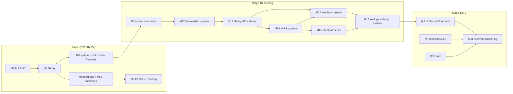

# Web Reader — Build Plan

> Staged **PoC → MVP → Full product**. Each milestone ends with something you can run and judge.
> Status: revised 2026-07-25 to put a vertical slice first (supersedes the horizontal-layer
> ordering); revised **2026-07-27** to reconcile completed work and reorganise the remaining
> backlog into M12–M17 (see *Current status* and *Backlog* below).

---

## Current status at a glance (2026-07-27)

Statuses: **Done** · **Done — manual/live verification pending** (works, with automated evidence,
but a named check has not been run in its real environment) · **Partially done** · **Not started**
· **Deferred**.

| Area | Status | Evidence / what is pending |
|---|---|---|
| Embedded browser + WebView bridge (M0) | **Done** | Simulator + live sites; bridge probes real DOMs |
| Single-page capture (M1) | **Done** | Fixture + one live chapter (uzaymanga 885, AVIF, Referer-gated CDN) |
| Offline storage + reader (M2) | **Done** | `offline_read_test` 3/3: source destroyed mid-run, read from disk |
| Bounded multi-chapter capture (M3) | **Done — live verification pending** | 5/5 fixture integration tests; multi-chapter chaining never run against a live site (single live chapter only) |
| User-assisted reader/next rules | **Done** | `user_assist_test` 5/5 incl. TR/DE/ambiguous/unlabelled fixtures; rules exercised live (read-only probes) |
| Series-grouped library + rename/identity (M4) | **Done** | 22 identity + 15 grouping tests; backfill non-destructive |
| Persistent reading progress (M5) | **Done — physical-device pass pending** | Restart path + lifecycle flush + serialization proven on Simulator; app-switcher-kill / background-then-kill need hands on a phone (§P0.1) |
| Continue Reading (M6) | **Done** | `reading_flow_test` + widget tests |
| Recently Read section (M6) | **Done — scheduled for removal in M13** | Superseded by the M13 library IA decision |
| Duplicate / re-capture UX (M5a) | **Done** | 20 preflight tests + atomic replacement + interrupted-replace restore (now actually run at startup) |
| Session-level duplicate decisions (M5a ext.) | **Done** | 10 tests drive the real loop; decisions persist across resume, reset per job |
| Atomic chapter replacement | **Done** | `.previous` step-aside + crash restore, tested |
| Manual new-chapter check (M8) | **Done — no live check run yet** | Fixture acceptance end-to-end + 11 unit tests; discovery reuses live-verified navigation, but no update check has run against a live site |
| Known-remote chapter metadata (M8) | **Done** | `knownRemote` rows, discovery fields, same-row capture fill-in |
| New Chapters section (M8) | **Done** | Populated by user-triggered checks only, by design |
| Image-dimension verification + manifest repair | **Done** | Live acceptance on chapter 885: manifest == file header on every panel; repair-on-open tested |
| Lifecycle write-path hardening | **Done — device pass pending** | Serialized writes, dispose-flush fix; same pending device checklist as M5 |
| Integration-test isolation | **Done** | Per-run-stamped DB/storage per file; per-boot for `user_assist` |
| Read vs. captured indicator in UI | **Partially done** | Data layer correct (defaults verified in schema/engine/migration); UI shows only the capture-state green check and no read/unread state — conflatable (§P0.2) |
| `capture_flow_test` self-containment | **Not started** | Still requires the external fixture server on :8099 (§P0.3) |
| Text extraction / novels (M7) | **Not started — deferred** | After the M12–M17 backlog |
| Pin / favorite / dormant (M9, minus archive) | **Not started — deferred** | Archive moved forward into M16 |
| Auth + session (M10) | **Not started — deferred** | |
| Recovery hardening (M11) | **Partially done** | Startup sweep, in-flight reset, reconciliation, interrupted-replace restore exist; low-disk guard, backup-exclusion key, error taxonomy, diagnostics screen do not |

---

## The first product checkpoint

> **The first successful vertical slice is: open one webtoon chapter, load all relevant images, save
> the actual image files locally, restart or go offline, and read the saved chapter without
> contacting the source website.**

That is **M2**. Everything in M0–M2 exists to reach it, and the early architecture should be judged
by whether it enables that flow — not by how complete any single layer is.

**Nothing below is built before the slice works:** cloud sync, remote crawling, scheduled checks,
login support, novel/text extraction, broad library organisation, or advanced reading-progress
behaviour. They are all M4+ and they all stay there.

---

## Stages

| Stage | Milestones | Exit criterion |
|---|---|---|
| **Stage 0 — PoC** | M0 – M3 | ✅ Done. The vertical slice works (M2), and a bounded multi-chapter run captures unattended (M3, fixture) |
| **Stage 1a — MVP core** | M4 – M6, M5a, M8 | ✅ Done (with the pending verifications named above). Library, progress, Continue Reading, duplicate UX, update checks |
| **Stage 1b — usability & reliability backlog** | P0 + M12 – M17 | The current work: correctness gaps closed, library IA fixed, a persistent activity queue, bulk checks, archive, appearance/design system |
| **Stage 1c — remaining MVP** | M9 (pin/favorite/dormant), M7, M10, M11 | Organisation, text content, auth, recovery hardening |
| **Stage 2 — Full product** | post-M11 | Site recipes, background checks, export, cloud backup — none designed in detail yet |

## How to read a milestone

**Goal** (why) · **Deliverable** (what exists afterwards) · **Acceptance** (the checks that make it
done) · **Risks** (what actually goes wrong here).

Two standing rules:

- **No milestone is done without its acceptance checks passing on the iOS Simulator.** "It compiles"
  is not a milestone.
- **Every milestone that touches capture ships unit tests against fakes.** `capture/` is pure Dart
  precisely so this is possible from M1c onward.

---

# Stage 0 — PoC

## M0 — Project scaffold and browser

**Goal.** Create the Flutter project and open normal web pages in an embedded WebView on the iOS
Simulator.

**Deliverable.**

- Flutter project using the working identity (`Web Reader`, `com.mcagricaliskan.webreader` — see
  [DECISIONS.md](./DECISIONS.md) D22), iOS + Android platform folders.
- Dependencies resolved to current stable versions at implementation time, per
  [DECISIONS.md](./DECISIONS.md) D21. `pubspec.lock` committed.
- Embedded, visible `InAppWebView`: URL entry, back / forward / reload / stop, page title, loading
  indicator.
- `BrowserController` interface + its plugin implementation. Nothing else in the app touches the
  plugin.
- `isInspectable` enabled in debug builds (iOS 16.4+ requires the opt-in) so Safari's Web Inspector
  attaches to the Simulator WebView.
- Minimal diagnostics: a visible error/status line for load failures, HTTP errors, and JS errors.
- `analysis_options.yaml` with `flutter_lints`; `Makefile` (`run`, `test`, `analyze`, `format`,
  `gen`); the `lib/` layout from [TECHNICAL_SPEC.md](./TECHNICAL_SPEC.md) §1 as empty folders;
  `git init` + first commit; root `CLAUDE.md` + `AGENTS.md`.

**Acceptance.**

1. The app launches on the iOS Simulator.
2. The user can enter or open a URL.
3. A normal public website renders and can be browsed manually.
4. **JavaScript execution from Dart is confirmed with a small DOM query** — e.g. returning
   `document.title` and an image count, displayed in the UI.
5. `flutter analyze` and `flutter test` are clean.

**Explicitly not required here.** Authentication, cookie persistence, capture, storage. Those are
M10 and M1 respectively.

**Risks.** Dependency resolution is the only real gate: confirm a clean iOS Simulator build with the
build-hooks-based `sqlite3` native bundling before building on it ([OPEN_QUESTIONS.md](./OPEN_QUESTIONS.md) Q07).

---

## M1 — Single-page webtoon capture (proof of concept)

**Goal.** Prove the app can capture the webtoon-style page currently open: inspect the DOM, find the
content images, scroll, trigger lazy loading, wait for stability, extract the ordered image URLs,
download the real files into app-managed storage, write a manifest, and mark the capture complete
**only** after the files are stored.

**Scope discipline.** Target **one** explicitly chosen public test site, or a controlled local
fixture served from a static directory. Do not attempt universal extraction. A local fixture is
worth building early because it makes the lazy-loading, slow-image, and broken-image cases
reproducible on demand.

### Sub-steps

Each is a day-scale piece with its own quick check; the milestone gate is the acceptance list below.

| # | Piece | Quick check |
|---|---|---|
| **M1a** | Drift DB with `source`, `library_item`, `chapter` (+ the indexes those need) · `FileStore` with **relative-path-only** resolution · schema v1 with a generated migration test | Insert an item + chapter, force-quit, reopen — still present; a test asserts no stored path is absolute |
| **M1b** | `webread_bridge.js` as a document-start `UserScript` · `__webread.probe()` returning image counts by size bucket, largest text-block length, canonical URL, `og:*`, page height · typed request/response over `callAsyncJavaScript` · page→Dart events over `callHandler` | Probe returns plausible values on the fixture and on the real target; survives navigation without manual re-injection |
| **M1c** | `__webread.startScroll/stopScroll` — stepwise scrolling, progress over the bridge, abortable, step- and time-bounded; finds the real scrolling element (many reader sites scroll a `div`, not the document) | A long page scrolls to the bottom with monotonic progress; `stopScroll()` halts within one interval |
| **M1d** | Page-stability detector per [TECHNICAL_SPEC.md](./TECHNICAL_SPEC.md) §6: MutationObserver + height sampler + image tracker, quiet window, second scroll pass, hard timeout, infinite-scroll detection · `StabilityProfile` config · a debug overlay showing live signal values | Stability resolves only after all content images are complete; a deliberately broken fixture image times out and reports *why* |
| **M1e** | `WebtoonImageExtractor` per §7.2: `currentSrc`/lazy-attribute resolution, size filter, chrome/ad exclusion, ancestor clustering, DOM ordering, intrinsic dimensions · debug view listing what was found and what was rejected, with reasons | On the target site the extracted set equals the visible chapter images, in reading order |
| **M1f** | `AssetFetcher` (dio, Referer + UA + WebView cookies, streamed to staging, verification, bounded concurrency and retries) · `ChapterStore` staging → verify → manifest → atomic rename → DB transaction · `manifest.json` writer/reader | A kill mid-download leaves a staging directory and **no** `captured` chapter |
| **M1g** | Minimal capture state machine covering the single-page path only (`openingPage → awaitingDom → scrolling → stabilizing → verifying → extracting → acquiringAssets → persisting → completed \| chapterFailed`) · orchestrator wiring M1b–M1f · a capture screen showing state, current URL, asset progress, last error, Stop | The state machine's tests run with no WebView, against fakes |

The multi-chapter states (`detectingNext`, `cooldown`, `navigating`, `paused`, `awaitingUser`,
`retrying`) are deliberately **not** built here — M3 adds them. Building the machine now rather than
a linear procedure is what makes that an extension instead of a rewrite.

**Acceptance** (the milestone gate):

1. At least one real or controlled webtoon chapter can be opened.
2. The page is automatically scrolled.
3. Lazy-loaded chapter images are detected.
4. The relevant image files are saved locally **in the correct order**.
5. **Failed downloads are visible and do not produce a false successful state** — a chapter with a
   failed required asset is `partial` or `failed` with a readable reason, never `captured`.
6. Restarting the app does not remove the saved chapter metadata or files.

**Risks.**

- **Over-fitting to the first site.** Mitigate with the local fixture, which lets you vary the
  failure modes without varying the site.
- **Simulator timings are optimistic** — network and disk are the Mac's. Record the numbers you see;
  they are provisional until measured on a device ([OPEN_QUESTIONS.md](./OPEN_QUESTIONS.md) Q03).
- **Hotlink protection**: assets that load in the page but 403 for a direct `dio` request. The
  in-page `fetch` fallback (§7.5) exists for this; if the target site needs it, build it here rather
  than deferring.
- Bridge payload limits — find them with a large probe at M1b, not with an asset at M1f.

---

## M2 — Minimal offline reader ← **first product checkpoint**

**Goal.** Prove captured content is genuinely usable without the source website.

**Deliverable.**

- A minimal local library entry for the captured chapter (list → chapter → reader; no organisation
  features, no sorting, no filters).
- Vertical image reader: a Flutter `ListView` over local files, **not** a WebView — memory-bounded
  (`cacheWidth`, dispose off-screen), correct scaling.
- Reading strictly from local files. No network request is made to open a captured chapter.
- Session persistence: reopening the app finds the captured chapter and its files.
- A clear visual distinction between `captured` (complete) and `partial` / `failed` chapters.

**Acceptance — the vertical-slice test, run in this exact order:**

1. Capture a chapter while online (M1).
2. Confirm its files exist locally (chapter directory + `manifest.json` + assets, all present).
3. Disable network access — Simulator with Wi-Fi off on the host, or Network Link Conditioner set to
   100 % loss.
4. Fully quit and reopen the app.
5. Open the chapter and read it end to end from local storage, **with no request to the source
   website**.

Plus: a `partial` chapter opens with a visible warning rather than looking complete; a chapter whose
files were deleted underneath shows "not offline" instead of crashing.

**Verification detail.** "No request to the source website" is asserted, not assumed — the reader
path must be observable as network-silent (a proxy, Charles, or simply the fact that step 3 leaves
the device unable to reach anything).

**Risks.** Image memory with large chapters; measure with the biggest chapter available, because the
Simulator will not warn you. Also the temptation to start building the real library UI here — resist;
M2 is a reader plus the thinnest possible entry point to it.

---

## M3 — Multi-page autonomous capture

**Goal.** The headline behaviour: capture a bounded run of chapters unattended.

**Deliverable.**

- Next-page strategy chain and candidate validator per [TECHNICAL_SPEC.md](./TECHNICAL_SPEC.md) §8,
  including the post-navigation re-check and the content-hash duplicate guard.
- Visited-set persistence; loop prevention; duplicate-chapter prevention via
  `UNIQUE(library_item_id, url_key)`.
- The remaining state-machine states: `detectingNext`, `cooldown`, `navigating`, `paused`,
  `awaitingUser`, `retrying`, `chapterFailed`.
- Session limits (`single` / `count` / `untilEnd`) and the hard bounds in §5.3.
- Persisted capture-session state written on every transition.
- Full capture screen: current chapter, captured count vs. limit, state, asset progress, retry
  count, last error, and **Pause / Resume / Retry / Skip / Stop**.
- Wakelock during a session; screen-dimming and accidental-touch handling as designed in
  [PRODUCT.md](./PRODUCT.md) §12.
- Every next-page candidate considered is logged with its strategy and confidence.

**Acceptance.**

1. Five consecutive chapters captured unattended on the target site.
2. A site with no next link ends as `completed(endOfChain)` — not as a failure.
3. An induced loop (a "next" pointing back) ends as `completed(loopDetected)`.
4. Pause / Resume / Skip / Stop each work mid-chapter; Stop leaves no partial `captured` chapter.
5. Force-quit mid-session, reopen: the session shows as interrupted and is resumable; nothing was
   marked captured that is not.
6. Re-running a capture over an already-captured chapter does not duplicate it.

**Status: done (2026-07-27).** 5/5 integration tests pass on the fixture; criterion 5 is covered by
`test/recovery_test.dart`, which reproduces the interrupted state at the layer that matters
(database + file tree) rather than killing a process. Multi-chapter chaining has **not** been run
against a live site — only a single live chapter has been captured. See
[IMPLEMENTATION_STATUS.md](./IMPLEMENTATION_STATUS.md) §9.

**Risks.** Wrong-but-plausible next links (a "next series" or "next comments page"). The confidence
ordering plus same-domain and visited-set validation is the defence; the candidate log is how you
diagnose it. Politeness defaults matter here — a 20-chapter run is the first thing a site might rate
limit ([OPEN_QUESTIONS.md](./OPEN_QUESTIONS.md) Q19).

**Stage 0 exits here.** At this point the product's core claim is proven.

---

# Stage 1a — MVP core (done 2026-07-27, pending verifications listed in *Current status*)

## M4 — Series-grouped library and series detail

**Goal.** Chapters of one series belong together; two series on one host stay apart.

**Deliverable (done 2026-07-27).**

- Series identity from the strongest available signal: a same-host link back to the series index →
  the URL's series-path fingerprint → page/`og:` title → host. Low confidence never merges.
- `library_items` is now a series group: `seriesKey` identity, `userTitle` for the editable display
  name, `seriesUrl`, `identityBasis`/`identityConfidence`, `lastCapturedAt`.
- Backfill that regroups captures made before this existed — reassignment only, no file moves.
- Grouped library list → series detail → existing offline reader, with a rename action.
- Chapter ordering by parsed number → capture sequence → capture time, supporting non-integer
  identifiers.

**Acceptance (met).** Three chapters of one series show as one group · two series on one host stay
separate · existing captures backfill with no data loss · a rename changes only the displayed name
and future captures rejoin the renamed group · chapters list in reading order · partial/failed are
flagged · a chapter tile opens the reader.

**Not in this milestone** (deferred by scope): cover downloading, Archive/Restore, *Delete item*,
*Capture more*, manual folders, tags, pin/favorite, merging or moving chapters between groups.

**Risks.** A wrong merge mixes two series on one shelf and is hard to notice — hence low-confidence
identities are kept separate rather than guessed at.

---

## M5 — Persistent reading progress

**Goal.** Never lose the user's place.

**Deliverable (done 2026-07-27).**

- `lib/reading/reading_position.dart` (pure Dart): `ReadingPosition` = hybrid anchor
  (`imageIndex` + `offsetInImage`) **plus** a normalised `fraction`; `ChapterLayout` derives panel
  geometry from the stored manifest dimensions, so the reader opens *at* the position rather than
  scrolling to it after layout; `CompletionPolicy` (0.97 of the chapter, held for 800 ms).
- `lib/reading/reading_repository.dart`: the only writer of reading state. `markOpened`,
  `saveProgress`, `markRead`, `markUnread`, plus `computeSeriesReadingState` and
  `repairSeriesReadingState` for the series pointers.
- Schema **v4**, additive: `chapters.read_status / progress_fraction / progress_image_index /
  progress_offset_in_image / first_opened_at / last_read_at / completed_at / progress_updated_at`;
  `library_items.last_opened_chapter_id / last_completed_chapter_id / last_read_at`.
- Reader restores through `ScrollController(initialScrollOffset:)`; writes are debounced 2 s and
  flushed immediately on lifecycle change, chapter change and dispose.

**The separation is enforced structurally.** `writeChapterReading` is the only DAO path that touches
a reading column and it touches nothing else; capture writes copy reading fields verbatim. Capture
cannot alter read state and reading cannot alter capture state.

**Acceptance (met, `integration_test/reading_flow_test.dart` on the Simulator).** Scroll to the
middle, restart, reopen — anchor and fraction restored · opening alone never completes · threshold +
dwell completes, a fling does not · *Mark as unread* keeps the anchor · re-downloading a chapter
leaves `read_status`, the anchor and `completed_at` untouched and creates no duplicate row.

**Risks.** iOS lifecycle callbacks. Force-quit, app-switcher kill and background-then-kill are
different paths; only the restart path is covered automatically.

**Hardened (2026-07-27, second pass).** The write path no longer depends on any final callback:
reading writes are serialized through one queue (a stale in-flight save can never undo a newer
state or a completion), the dispose-time flush was fixed (Riverpod 3 forbids `ref` in `dispose`;
it had been throwing, losing the final position on every ordinary reader close), and automated
lifecycle tests cover restore-at-open, flush-on-backgrounding inside the debounce window, and
no-false-completion on a kill mid-fling. **The physical-device pass (app-switcher kill,
background-then-kill) is still pending** — the exact checklist is in
[IMPLEMENTATION_STATUS.md](./IMPLEMENTATION_STATUS.md) §10.

---

## M5a — Duplicate and re-capture UX

**Goal.** Capturing something already held is a choice, never a silent re-download or a silent skip.

**Deliverable (done 2026-07-27).**

- `lib/capture/capture_preflight.dart` classifies the target before any network use:
  `none · complete · partial · failed · filesMissing · inActiveJob`, over a single chapter or a
  planned range.
- `DuplicatePolicy { skipComplete, retryPartial, replaceAll, ask }`; the job consults preflight per
  chapter, so a range run skips what it already holds and reports the skip in the log.
- A bottom sheet offers only the actions the state allows — *Open saved chapter*, *Capture following
  chapters*, *Re-download this chapter*, *Retry missing files*, *Repair capture*, *Remove broken
  local record*, *Resume existing capture*.
- Replacement is atomic: the existing directory is stepped aside to `.previous`, staging is moved
  in, the backup is deleted; a failure restores it, and `restoreInterruptedReplacements()` finishes
  the job after a crash. A re-download therefore never leaves a chapter unreadable.

**Acceptance (met).** 20 tests in `duplicate_capture_test.dart` plus criterion 10 of the M5
integration test.

**Extended (2026-07-27, second pass) — duplicates met *during* a run.** A running job that walks
onto an already-captured chapter no longer applies a policy silently: under the new default
(`DuplicatePolicy.ask`) it pauses and asks — *Skip* / *Re-download* / *Stop capture*, with "use
this choice for all already captured chapters in this capture session". Session answers persist on
the job row (surviving an interrupted-session resume), reset with every new job, and are never a
global preference; *Stop* is never recordable. Partial/failed chapters get state-appropriate
choices instead. The requested count now explicitly means **new capture attempts** — skips consume
a separate bound (`maxSkippedPerJob`), and the final report states requested / captured / skipped /
traversed. 10 tests in `session_duplicate_test.dart` drive the real loop with real downloads.

---

## M6 — Continue Reading and Recently Read

**Goal.** One tap from launch to reading.

**Deliverable (done 2026-07-27).**

- The library screen leads with **Continue Reading** (series with an unfinished or unopened chapter,
  most recently read first) and **Recently Read** (series read recently, including fully finished
  ones), above the full **All Series** list.
- Both are derived from the same `computeSeriesReadingState` the reader writes through, over the
  existing drift `.watch()` stream — no second source of truth and no manual refresh.
- A Continue card names the exact chapter and its progress, and one tap opens the reader at the
  saved position.

**Acceptance (met, `reading_flow_test.dart` + `library_ui_test.dart`).** Launch → tap the first card
→ reading at the saved position in one tap · completing chapter 1 advances Continue to chapter 2 with
no refresh · a fully-read series leaves Continue but stays in Recently Read · *Mark as unread*
restores it to Continue · a never-opened series appears with its first chapter · correct after
restart.

**Deferred from this milestone.** *New Chapters* — it needs the M8 update check to have anything to
report; until a source is re-polled there is no such thing as a new chapter.

**Revised 2026-07-27:** the **Recently Read section is scheduled for removal in M13** — Continue
Reading covers returning to unfinished reading, and All Series sorted by last read (new in M13)
covers revisiting finished series. Continue Reading itself is unchanged.

**Risks.** Edge-case query correctness (all chapters completed; nothing captured; read then
archived) — covered by fixture tests.

---

## M7 — Text extraction and reader

> **Deferred to Stage 1c (2026-07-27):** scheduled after the M12–M17 backlog. Kept here unchanged.

**Goal.** Novels and articles, not just images. *Parallel-safe with M5–M6.*

**Deliverable.** Readability vendored and injected ([OPEN_QUESTIONS.md](./OPEN_QUESTIONS.md) Q22) ·
`ReadableTextExtractor` with sanitisation · `content.html` + `content.txt` with inline images
downloaded and rewritten to relative paths · text reader in a WebView with reader CSS, **JavaScript
disabled**, no remote loading, and scroll anchoring over the bridge.

**Acceptance.** An article and a novel chapter extract with body text intact and navigation/ads gone ·
saved HTML contains no `<script>`, no `on*` attributes, no remote resource URLs · position restores by
anchor, and by fraction when the anchor does not resolve · a page below `minChars` is rejected as
`extractionUnsupported` rather than saved empty.

**Risks.** Restoring position in a WebView before images and fonts settle lands in the wrong place.

---

## M8 — Manual new-chapter check and New Chapters

**Goal.** Find out what the source has published since. *Parallel-safe with M5–M7.*

**Deliverable (done 2026-07-27).**

- `lib/library/update_checker.dart`: foreground, user-triggered, **metadata only** — a discovered
  chapter becomes a `knownRemote` row with no local content, never a fake offline chapter.
  Downloading stays a separate, explicit act.
- Discovery order: the series page's chapter list (`discoverFromChapterList`, pure and unit-tested)
  → bounded next-chain walk from the latest known chapter, over the same trust chain captures use:
  saved rule → generic detection → **ask the user** (the same selection overlay, teaching the same
  reusable rule).
- Bounded by construction: `UpdateCheckConfig` caps pages inspected (12), new chapters per check
  (20), total duration (3 min) and per-page navigation; the walk stops at end-of-chain, on leaving
  the series or host, on deny-listed paths (login/account), on cancel, and at every bound.
- Check state persisted per series: `last_check_at`, `last_check_success_at`, `last_check_error`,
  `last_check_result` — failures included, so "it last failed, and why" survives a restart. Latest
  known / uncaptured counts are derived from the chapters table, never denormalised.
- Series detail: *Check for new chapters* / *Check again* / *Cancel check*, a "New on source — not
  downloaded" list shown separately from saved chapters, and *Capture N new chapters* feeding the
  ordinary capture job.
- Library home: a **New Chapters** section (Continue Reading → New Chapters → Recently Read → All
  Series) with per-series count, latest-known vs latest-captured, last successful check, and the
  last failure when there was one.
- One WebView, one driver: the checker and the capture job refuse to start while the other owns the
  browser (`automationOwner`).

**Acceptance (met, `integration_test/update_check_test.dart` + `update_checker_test.dart`).**
Capture 1–2, the source publishes 3–4, check discovers both **without downloading** · the series
appears in New Chapters · capturing them clears the count and creates no duplicate rows · re-check
reports `upToDate` · check state survives a restart · a second check never duplicates discovery
rows · a page that is not a chapter list is *unrecognised* (falls back to the walk), never "up to
date" · read state untouched throughout.

**Deferred from this milestone.** *Check all active series* — the per-series check is the product
requirement; a library-wide sweep adds sequential-run UI plumbing without new machinery, and can sit
on top later. `authRequired` as a distinct state waits for M10, which owns session detection; today
a login redirect is stopped by the deny-list/series checks and reported as a failed check.

**Risks.** Chapter-list heuristics vary wildly per site; the bounded walk is the honest fallback and
must not silently become the primary path.

---

# Stage 1b — Reorganised backlog (2026-07-27)

> **Revised 2026-07-28 (D46):** M14's queue is now *queue-first* — adding a
> capture request never starts it. The Browser opens only on an explicit
> **Start Capture**, and the Library carries a compact `Capture queue · N
> waiting` strip. Batch re-download of removed episodes and a debug-only full
> local reset ship alongside it.

> Priority order: **P0 → M12 → M13 → M14 → M15 → M16 → M17**, then Stage 1c (M9, M7, M10, M11),
> then Stage 2. This follows the requested ordering unchanged; the only dependency worth naming is
> that M15's "exclude archived" clause only becomes meaningful once M16 exists — M15 ships checking
> every series (all series are active until archive exists) and inherits the exclusion when M16
> lands.

## P0 — Correctness and small reliability gaps

Small, independent tasks — not a milestone. None of them should grow architecture.

### P0.1 — Physical-device lifecycle pass for reading progress

**Goal.** Close the one unproven part of M5. **Outcome:** M5 can be marked *Done* without
qualification. **Pieces:** none — this is running the existing 8-step checklist in
[IMPLEMENTATION_STATUS.md](./IMPLEMENTATION_STATUS.md) §10 on the physical iPhone (foreground
app-switcher kill · background-then-kill · immediate force-quit · restoration accuracy ·
completion-state correctness). **Dependencies:** a connected phone and hands on it — this cannot be
automated. **Acceptance:** every checklist step recorded with its observed result in
IMPLEMENTATION_STATUS §10. **Tests:** manual by nature; the automated approximations already exist.
**Risks:** a real flush gap on a path the Simulator cannot reproduce — which is precisely why this
is P0. **Non-goals:** any code change unless the pass finds a defect.

### P0.2 — Read/unread vs. captured indicator ✅ *(done 2026-07-27)*

**Goal.** "Saved" and "read" must be visually distinct everywhere. **Outcome:** a user can tell an
unread-but-captured chapter from a read one at a glance. **Pieces:** the data layer is already
correct (verified: schema default `'unread'`, engine carries `existing?.readStatus ?? 'unread'`,
the v4 migration backfills the default — no data repair needed). The gap is UI-only: chapter tiles
and series cards show `captureStatusIcon` (a **green check for capture-complete**) and never show
`read_status`. Change the capture-complete glyph to something non-checkmark (e.g. a download/
offline glyph), add a distinct read indicator (and unread-count badge where the tile is a series),
and add one assertion test over migrated/seeded data proving no chapter is displayed as read
without `read_status == completed`. **Dependencies:** none. **Acceptance:** a freshly captured
chapter is visibly unread · a completed chapter is visibly read · capture state and read state are
never expressed by the same glyph. **Tests:** widget tests on tile/card states; a data assertion
over a seeded pre-v4-style row. **Risks:** none of substance. **Non-goals:** the broader M17
visual redesign — this is a correctness fix using existing widgets.

### P0.3 — Self-contained `capture_flow_test` ✅ *(done 2026-07-27)*

**Goal.** Remove the last external test dependency (`dart tool/fixture/serve.dart 8099`).
**Outcome:** every integration test runs with one command. **Pieces:** move `capture_flow_test` to
the in-process fixture pattern the other five files already use. **Dependencies:** none.
**Acceptance:** the file passes with no server started beforehand. **Tests:** itself. **Risks:**
none. **Non-goals:** restructuring the suite.

### P0.4 — Integration-test isolation ✅ *(done 2026-07-27)*

Per-run-stamped databases and storage roots per file; per-boot for `user_assist`. Recorded here
because it was on the correctness list; nothing remains.

---

## M12 — Live reader progress UI ✅ *(done 2026-07-27)*

**Goal.** The visible percentage and panel position update *while* scrolling, not after leaving
the reader. **User-facing outcome:** the footer progress bar and percentage move with the thumb;
the current-panel anchor is honest in real time. **Main pieces:** separate the already-computed
in-memory `_position` (updated every scroll event) from persistence — today both the footer and
the DB see it only after a flush-triggered rebuild; drive the footer from a lightweight
`ValueNotifier`/`ListenableBuilder` on the in-memory position so no full-screen `setState` per
frame; leave the 2 s debounced DB write, lifecycle flushes and dwell-gated completion exactly as
they are. **Dependencies:** none (may precede everything after P0 — it is a contained fix).
**Acceptance:** percentage visibly changes during a scroll · panel anchor updates during a scroll ·
DB writes remain ≤ 1 per 2 s while scrolling · close/lifecycle still flush the final state ·
completion dwell unchanged · no scroll jank (no per-frame rebuild of the panel list).
**Tests:** widget test asserting the visible percentage changes *before* the debounce elapses and
that the DB row has not yet changed at that instant; existing lifecycle tests stay green.
**Risks:** accidentally rebuilding the `ListView` per scroll tick — the notifier must scope to the
footer. **Non-goals:** any visual redesign of the footer (M17), any change to write frequency.

---

## M13 — Library usability and status correctness ✅ *(done 2026-07-27 — backend, then the UI with the Claude Design implementation)*

> Landed ahead of the design: the settings store (schema v6, first key: the persisted
> `LibrarySort`, default last-read per Q26, applied in `seriesGroupsProvider`), the per-series
> counts (`unreadOfflineCount`, check-state helpers where "never checked" is `null`, not zero),
> and the narrow `seriesChaptersProvider` (value-distinct per series — a progress write for
> series A provably produces no emission for series B). The design drop then delivered the UI:
> Recently Read removed, sort control on the All Series header, redesigned rows with per-series
> check chips ("not checked yet" as its own state, live "Checking"), a check action in the row's
> overflow sheet running the M8 checker, and one worst-first warning line per row.

**Goal.** One trustworthy library screen: what you have, what is new, what is wrong — per series,
at a glance. **User-facing outcome:** Continue Reading + a single All Series list with sorting,
honest per-series counts and check state, and update checks launchable right from the list.

**Main pieces.**

- **Remove the Recently Read section** (supersedes part of M6 and PRODUCT.md §8's section list;
  Continue Reading already covers "get back to what I was reading", and a fully-read series is
  reachable from All Series sorted by last read).
- Keep **Continue Reading**; keep **All Series** as the main library.
- **All Series sorting:** by name and by last read; selection **persisted** (first user preference
  in the app — a small `settings` table or key-value store, which M17 will reuse).
- **Consistent series-level counts:** unread local chapters · known-remote (new) chapters ·
  offline chapters · partial/failed/missing-content warnings. Remote-new counts exist **only after
  a check**: a never-checked series shows *"not checked yet"*, never a zero.
- **Per-series check action in the list** (button on the card/row), reusing the M8 checker and its
  mutual-exclusion rules.
- **Check-state display per series:** not checked yet · last checked ⟨relative time⟩ · check
  failed (with reason) · N new chapters.

**Dependencies:** M12 recommended first (small); P0.2 changes the same tiles — land P0.2 before or
inside M13 to avoid touching the glyphs twice. **Acceptance:** Recently Read gone · sort toggles
between name/last-read and survives a restart · every count on a card is derivable from the DB and
verified by a widget test seeding each state · a never-checked series says "not checked yet" ·
a failed check shows its reason on the card · tapping the card's check action runs exactly the M8
per-series check and is disabled while the browser is owned. **Tests:** widget tests per card
state; sort-persistence test; count-derivation tests over seeded edge cases (all read; only
knownRemote; files missing). **Risks:** count logic drifting from `computeSeriesReadingState` —
derive, never duplicate. **Non-goals:** visual redesign (M17) · covers (later) · pin/favorite (M9)
· any change to how checks work internally.

---

## M14 — Persistent activity queue and manager ✅ *(done 2026-07-27: backend, then strip + Activity screen with the design, then entry-point routing)*

> Landed ahead of the design: the `queue_tasks` table (v6, deliberately separate from
> `capture_jobs` — that table is the capture loop's own resume record with a delete-on-completion
> lifecycle; queue entries ARE the history) and `TaskQueueController`: FIFO, one task at a time
> serialized on `automationOwner`, restart → resume **offered** never auto-run (Q24, a
> `running` row left by a kill demotes to `queued`), cancel queued/running, retry-as-clone,
> bounded history, and clear-history-keeps-content (asserted against real files). 8 scheduler
> tests with fake runners. `restore()` runs at app startup. Remaining: the activity strip, the
> full manager screen, and routing the existing UI entry points through `enqueue*`.

**Goal.** All autonomous work — captures and checks — runs through one persistent, observable
queue instead of ad-hoc single jobs. **User-facing outcome:** a compact activity strip at the top
of the library whenever work exists (current operation · series/chapter · pending / completed /
failed counts · overall progress), tapping into a full activity manager with pause / resume /
cancel / retry.

**Main pieces.**

- **Build on `capture_jobs`, do not replace it:** generalise the row into a queue entry
  (`taskType: chapterCapture | multiChapterCapture | seriesCheck | checkAllSeries`, `queuedAt`,
  `startedAt`, `finishedAt`, `outcome`, `orderIndex`), additive migration.
- A `TaskQueueController` that owns *scheduling* only: one task runs at a time, serialized on the
  shared WebView via the existing `automationOwner`; the task bodies remain
  `CaptureJobController` / `UpdateChecker` exactly as they are.
- **Persistence:** queue rows survive restart; on launch, interrupted/queued work is **offered**
  for resume, never auto-resumed (consistent with D-series resume policy and the M3 resume card,
  which this supersedes).
- Pause/resume/cancel per task where the underlying controller supports it (captures: yes;
  checks: cancel only); retry re-enqueues a failed task.
- **Bounded history:** completed/failed entries capped (e.g. last 50); *Clear history* deletes
  queue rows only — never captured content (asserted).

**Dependencies:** M13 (the strip lives on the reworked library screen). **Acceptance:** enqueue a
capture and a check → they run sequentially, never concurrently on the WebView · strip shows
operation, target, counts and progress · kill the app mid-queue → relaunch offers the remaining
queue, nothing auto-runs · cancel/retry behave per task type · clearing history leaves every
chapter readable (asserted) · history stays bounded. **Tests:** unit tests on the scheduler with
fake tasks (ordering, serialization, persistence round-trip, history cap, clear-history safety);
widget tests for the strip states; one integration test enqueueing capture+check on the fixture.
**Risks:** the queue becoming a second job system — the guard is that task bodies stay in the
existing controllers; if a capability is missing, extend the controller, not the queue.
**Non-goals:** parallel execution · scheduled/background work · cloud sync (may later reuse this
model, explicitly out of scope) · redesigning capture internals.

---

## M15 — Check all active series ✅ *(done 2026-07-27)*

**Goal.** One tap answers "what's new across everything I follow?". **User-facing outcome:** a
*Check all* action in the library that walks every series sequentially with visible
total/completed/failed/remaining, cancellable, surviving restart.

**Main pieces:** a `checkAllSeries` task type on the M14 queue that expands to per-series
`seriesCheck` entries (or iterates internally with per-series outcome rows — choose whichever
keeps M14's history model simple); continues past individual failures; excludes archived series
once M16 exists (until then: all series). **Dependencies:** M14 (runs on the queue), M8 (the
checker). **Acceptance:** N series → N sequential checks, one WebView owner throughout · one
failing series does not stop the rest and is listed with its reason · counts visible during the
run · cancel stops after the in-flight series · kill mid-run → relaunch offers the remainder ·
archived series (post-M16) are skipped and say so. **Tests:** queue-level unit tests with fake
checkers (failure continuation, cancel, resume-offer); integration test over two fixture series.
**Risks:** long sequential runs magnify per-site flakiness — bounded per-series by the existing
`UpdateCheckConfig`, and the whole run is cancellable. **Non-goals:** scheduled or background
checking · parallel checks · auto-capturing what a check finds (Q21 stays Stage 2).

---

## M16 — Archive and restore ✅ *(done 2026-07-27, schema v7)*

**Goal.** Put a series away without losing anything. **User-facing outcome:** *Archive* on the
series detail (and library row); archived series leave Continue Reading, the default All Series
view and bulk checks; an Archived view lists them; *Restore* brings everything back exactly.

**Main pieces:** `lifecycle` field on `library_items` (`active | archived`, additive migration —
the fuller `dormant`/`lifecycle_before_archive` model stays in M9); filters in the library
providers; an Archived view (behind a toggle or menu); restore; **preservation is the contract** —
captured chapters, local files, reading progress, known-remote rows, `userTitle`, site rules and
check state are all untouched by archive/restore; queued-work interaction: archiving a series with
active/queued work either blocks with a message or cancels its queued tasks after confirmation
(decision: [OPEN_QUESTIONS.md](./OPEN_QUESTIONS.md) Q25). **Dependencies:** M13 (library views),
M14 (queue interaction), feeds M15's exclusion. **Acceptance:** archive removes the series from
Continue Reading / default All Series / *Check all* · a full row+files diff across archive→restore
shows only the lifecycle field changed · per-series check still works on an archived series from
its detail screen (Q13 default) · no sweep or cleanup path takes `lifecycle` as an input (asserted
the same way M9 planned to) · archive with queued work resolves per the Q25 decision, never
silently. **Tests:** provider filter tests · archive/restore round-trip diff test · sweep-safety
test · queue-interaction test. **Risks:** "archived treated as deleted" — the round-trip-diff and
sweep tests exist to catch exactly that. **Non-goals:** permanent deletion (separate, later
action) · pin/favorite/dormant (M9) · auto-archive policies.

---

## M17 — Settings, appearance, and the design system *(partly done — see M18)*

> **Status 2026-07-28.** The appearance setting, `ThemeMode` wiring, the dark
> palette and the token layer shipped with M18, and the Browser surfaces, the
> app shell and Settings render correctly in both appearances. What remains is
> the mechanical part: converting Library, Series Detail, Reader, Storage,
> Activity, Archived, Rules and the capture/cleanup sheets from literal
> colours to `AppPalette` (~200 call sites, most of them `const`). Until then
> Dark is correct on the new surfaces and wrong on the old ones.

**Goal.** A settings surface, light/dark/system theming, and a reusable visual system — a polished
Flutter UI, not a recolored demo. **User-facing outcome:** a Settings screen with Appearance
(System/Light/Dark, persisted); every surface — library, browser, reader, series detail, capture
UI, activity manager, dialogs and sheets — consistent in both themes; visibly deliberate
typography, spacing, and states.

**Main pieces.**

- Settings screen + persisted preferences (reuses M13's settings store).
- `ThemeMode` wiring end-to-end; audit and remove hard-coded colors (the reader's black surface
  stays black by design; everything else theme-derived).
- A small design system in `lib/ui/`: typography scale · spacing tokens · surface/elevation rules ·
  button styles · **status badges** (captured/partial/failed/unread/new/checked states get one
  vocabulary) · empty states · error states · loading states.
- **Performance requirements as acceptance, not aspiration:** lazy lists/slivers with stable keys ·
  narrow reactive queries so one chapter's progress change does not rebuild the whole library
  (today `seriesGroupsProvider` recomputes every group on any table change — split it) ·
  restrained animation · compact-iPhone (SE-width) layouts · Android-compatible layout (no
  iOS-only widgets in shared surfaces).

**Dependencies:** after M13–M16 so the redesign styles the final IA rather than being redone.
**Acceptance:** theme switch applies live to every listed surface, both directions, persisted
across restart · a seeded 200-series library scrolls without dropped frames on the Simulator
profile build · a progress write for one chapter rebuilds only that series' widgets (verified with
a rebuild counter in a widget test) · every status in the app uses the badge vocabulary · empty/
error/loading states exist for library, series detail, activity manager and reader. **Tests:**
theme-application widget tests per surface · rebuild-scope test · golden or structural tests for
the badge set. **Risks:** scope creep into a full rebrand — the design system is tokens and
components, not a new product identity; performance work hiding behind visuals — hence the
explicit rebuild-scope acceptance. **Non-goals:** covers/artwork, onboarding, iPad layout,
Android *testing* (layout compatibility only).

---

## M18 — The Browser experience ✅ *(done 2026-07-28, schema v10)*

**Goal.** The Browser stops being an address bar with a WebView under it and
becomes the surface the design draws: somewhere to start, somewhere to come
back to, and a page you can act on. **User-facing outcome:** Browser Home with
saved sites and recent pages; a readable, editable address; local history you
own and can clear; page actions that do something.

**Shipped.**

- Explicit navigation model — one WebView, three surfaces, one Back rule
  (D52). Home and the URL editor are layers; the page underneath is never
  torn down, reloaded, or re-authenticated.
- Toolbar: Back · Forward · Address · Refresh/Stop · **Home**; the permanent
  Go button removed.
- Browser Home, expanded URL editor with ranked local suggestions, History
  (pages + sites, search, clear-by-range), Saved Sites with the two-tab Add
  flow and duplicate handling, page-actions menu, find in page, site
  information, clear website data.
- Schema v10: `browsing_history`, `saved_sites`, `favicon_cache`.
- Only manual navigation is recorded, enforced twice (D53). Retention 90 days
  or 5,000 rows.
- Appearance setting + `AppPalette` (D56) — this is the part of **M17** that
  landed here, because dark mode is what forced the token layer.

**Deliberately out.** No search-engine setting (the design has no picker). No
remote suggestions. No per-site permission UI beyond cookies. No tab model.

**Carried forward.** The palette conversion of the pre-M18 screens — see M17
below, which is now scoped down to exactly that.

---

## M19 — Direct capture, and page-scoped Browser state ✅ *(done 2026-07-28, schema v11)*

**Goal.** Make the Browser's capture button honest: it should start a capture
when the user wants one now, queue one when they want it later, and describe
the page they are actually looking at. **User-facing outcome:** two clearly
different actions in one sheet, and a capture control that resets when the
page does.

**Shipped.**

- **Two launches, one sheet** (D58). The range sheet ends in *Add to Queue*
  (secondary) and *Start Capture* (primary), with one line of supporting copy
  and no second drawer. Both fit at 320 pt; validation errors keep the sheet
  open; the first tap disables the second.
- **A direct capture lifecycle** — `TaskQueueController.startDirectCapture`:
  ownership check → `ensureBrowserVisible` (the same D47 gate queued work
  passes) → `capture_jobs` row with `origin = direct` → run → terminal
  `origin = direct` Activity row. **No pending `queue_task` at any point.**
- **Queue isolation.** Pending captures are not started, released, reordered
  or consumed by a direct run, and finishing one does not authorise the batch;
  an explicitly started batch still survives. `_directCaptureClaimed` closes
  the window between claiming the Browser and taking `automationOwner`.
- **Ownership conflicts.** `browserOwner` names the holder; the sheet then
  offers *View active task* + *Add to Queue* instead of *Start Capture*, and a
  download-only phase is named as such rather than as "using the Browser".
- **The launch survives the duplicate preflight** — re-download from *Start
  Capture* starts; re-download from *Add to Queue* waits.
- **Page-scoped Browser state** (D59) — the stale-completed-state fix.
  `BrowserController.pageSession` + `pageIdentityKey`;
  `resolveBrowserCaptureState` derives the control from the page on screen;
  a finished run becomes a dismissible, page-scoped result banner and the
  control returns to idle.
- **Recovery keeps its launch** — schema v11 (`capture_jobs.origin`,
  `queue_tasks.origin`); Resume/Discard on an interrupted direct capture
  resumes it directly, never as queued work.

**Deliberately out.** Parallel captures. One `CaptureJobController` means one
run at a time, so "start a second capture while the first is downloading" is
still refused — with an honest reason rather than a silent failure.

---

# Stage 1c — Remaining MVP (deferred, unchanged in substance)

## M9 — Pinned, favorite, dormant *(archive moved to M16)*

**Goal.** Durable organisation that never costs history.

**Deliverable.** Pin/unpin with `pinned_order` (automatic ordering; drag-and-drop optional —
[OPEN_QUESTIONS.md](./OPEN_QUESTIONS.md) Q11) · favorite toggle · `dormant` lifecycle state joining
M16's `active | archived` (with `lifecycle_before_archive` for exact restore) · Pinned / Dormant
views.

**Acceptance.** Every combination of lifecycle × pinned × favorite is reachable and displays
correctly, including an archived favorite · a full row diff across archive/restore shows only
lifecycle fields changed · **no cleanup or sweep path takes `lifecycle` as an input** — asserted by
a test that seeds an archived item and runs every sweep.

**Risks.** This is where "archived treated as deleted" bugs are born. The last acceptance point is
the one that catches them.

---

## M10 — Authentication and session persistence

**Goal.** Capture from sites that require a login. Deliberately late: most initial targets are
public, and login is not the first product risk.

**Deliverable.** Confirmed persistent (non-incognito) WebView data store · manual login inside the
WebView, with no credential handling of any kind by the app · capture using the authenticated
session · detection of expired authentication mid-session → `awaitingUser` with the WebView surfaced
and a resume path · asset downloads carrying the WebView's cookies.

**Acceptance.**

1. Log in manually on a real site inside the WebView.
2. Force-quit and reopen — still logged in.
3. Capture a chapter that is only reachable while authenticated.
4. Expire or clear the session mid-run → session moves to `awaitingUser`, not `failed`; after manual
   re-login, Resume continues correctly.
5. **No automatic credential collection** — the app never reads, stores, or autofills a username or
   password. Verified by inspection.
6. **No cloud transfer of cookies** — there is no network egress other than to the source site;
   cookies are never written to the database or to any log ([TECHNICAL_SPEC.md](./TECHNICAL_SPEC.md) §16).

**Risks.** Sites that rotate sessions aggressively, or that treat our scroll pattern as suspicious
while logged in. Both surface as `authRequired` and are handled by pausing for the user, which is the
correct behaviour rather than something to engineer around.

---

## M11 — Recovery and reliability hardening ← **MVP checkpoint**

> **Partially done already (2026-07-27):** the startup sweep, in-flight chapter reset,
> manifest reconciliation and interrupted-replacement restore exist and are tested
> (`recovery_test.dart`). Still missing: low-disk guard, `NSURLIsExcludedFromBackupKey`,
> the error taxonomy wired to UI, the diagnostics screen, and the induced-failure acceptance run.

**Goal.** Make the failure modes in [TECHNICAL_SPEC.md](./TECHNICAL_SPEC.md) §13–§14 real rather than
aspirational.

**Deliverable.** Startup sweep (staging orphans, in-flight chapter reset, committed-but-unrecorded
reconciliation, orphaned sessions) · resume-session card, never auto-resume ·
`verifyOfflineAvailability()` · low-disk guard ([OPEN_QUESTIONS.md](./OPEN_QUESTIONS.md) Q20) ·
`NSURLIsExcludedFromBackupKey` on the assets tree · full error taxonomy wired to UI messages ·
diagnostics screen with a redacted, exportable capture log · event-log rotation.

**Acceptance.** Each induced deliberately, producing the documented outcome:

1. Kill during download → staging swept, chapter `notCaptured`, resume offered.
2. Kill after rename, before the DB transaction → reconciled from the manifest.
3. Delete a chapter directory manually → shows "not offline", history intact.
4. Simulated disk-full → `failed(storage)`, no partial commit.
5. Auth lost mid-session → `awaitingUser`, resume works after manual login.
6. Exported logs contain no cookies, tokens, or auth query parameters.
7. Force-quit during a progress write → at most the throttle window is lost.

**Risks.** These paths are only exercised if you induce them. Budget the milestone for deliberate
sabotage, not happy-path polish.

**Stage 1 exits here** — see [PRODUCT.md](./PRODUCT.md) §6.2 for the MVP checkpoint script.

---

# Stage 2 — Full product

Not scheduled, and nothing above is designed around them: site recipes and a recipe editor ·
scheduled/background update checks · headless capture · batch "capture all new" (Q21) · Android
hardening · export (EPUB/CBZ) · full-text search · tags and manual folders · covers and richer
metadata · cloud backup, then sync · desktop/PC or web reader · browser extensions. See
[PRODUCT.md](./PRODUCT.md) §14.

---

## Priority order (2026-07-27)

1. **P0** — correctness: device lifecycle pass (P0.1), read-vs-captured indicator (P0.2),
   self-contained `capture_flow_test` (P0.3). *(P0.4 isolation: done.)*
2. **M12** — live reader progress UI (contained fix; scheduled before the visual redesign on
   purpose).
3. **M13** — library usability and status correctness.
4. **M14** — persistent activity queue.
5. **M15** — check all active series.
6. **M16** — archive and restore.
7. **M17** — settings, appearance, design system.
8. **M9** — pin / favorite / dormant and further organisation.
9. **M7** — novel/article extraction and text reader.
10. **M10 / M11** — auth, then recovery hardening (MVP checkpoint), then Stage 2 (cloud and
    cross-device among it).

No deviation from the requested order. Two dependency notes rather than reorderings: P0.2 touches
the same tiles as M13, so land it immediately before or as the first commit of M13; and M15's
archived-exclusion clause activates when M16 lands (M15 itself does not wait for M16).

---

## Change log

**2026-07-27 (storage cleanup + Browser-leave, design v2).** Schema v9
(`offlineRemovedAt`, `pauseReason`). Offline-file removal as a first-class,
non-destructive operation (D35) with undo; the leave-the-Browser confirmation
and pause/resume semantics (D36); the after-finished cleanup preference with
exact "Don't ask again" behaviour (D37); a functional Storage screen with a
minimal Library entry; selection mode in Series detail; bulk cleanup through
the activity queue with live progress. 419/419 tests.

**2026-07-27 (capture hardening, post-audit).** Schema v8 (`rangeMode` on jobs and queue
tasks); capture range UX reduced to exactly three choices with a safety-limited until-end mode;
hidden-WebView pause protection (`waitingForBrowser`) across capture and checks plus a
collapse guard against avatar extraction; adaptive scrolling (D33 — scroll was 90–98% of real
capture time); disk-space policy end to end with a hand-rolled platform channel and iCloud
backup exclusion for assets (D34, closes Q20 and two M11 bullets); MIME-derived stored
extensions (D31); storage totals in Settings; repo-root `CLAUDE.md` with the Live-Site
Verification Protocol and matrix; live tests report PASSED/BLOCKED/SKIPPED explicitly and a
bounded 2-chapter Asura smoke test was added. Format conversion explicitly rejected (D30).

**2026-07-27 (later still) — M14 routing, M15, M16 landed; plugin pinned to 6.2.0-beta.3.**
All capture/check entry points route through the activity queue; check-all expands to
per-series rows with bulk cancel; schema v7 adds `lifecycle`/`archivedAt` with archive/restore,
the Archived screen, and Q25 settled as confirm-and-cancel. The WebView plugin moved to
`6.2.0-beta.3` (D29) after the full iOS battery passed on it — Android `apk --debug` now
builds under AGP 9.

**2026-07-27 (later) — Claude Design UI implemented.** New flat theme (no token layer — D28),
bundled Newsreader/IBM Plex fonts, shared status vocabulary, and redesigned library / series
detail / reader / browser / capture surfaces, plus new Activity and Settings screens. Closes
M13 fully and M14's strip + manager UI. M17 shrinks to: appearance setting + dark theme,
rebuild-scope/performance acceptance, and the remaining polish — the "design system" bullet is
superseded by the shipped implementation. M16's Archived screen is designed but blocked on the
schema v7 `lifecycle` column (approval needed for the persisted-schema change). Found during
validation: `flutter build apk` failed inside `flutter_inappwebview_android` 1.1.3 (AGP 9
rejects its `proguard-android.txt`) — resolved the same day by pinning `flutter_inappwebview`
to `6.2.0-beta.3` (user-approved; apk builds, full iOS battery re-run green on the pin — see
IMPLEMENTATION_STATUS §2 limitation 4).

**2026-07-27 — reconciled and reorganised the backlog.** M0–M6, M5a and M8 marked done against
actual evidence (with the pending verifications named per-area rather than hidden); Recently Read
scheduled for removal; archive pulled forward out of M9 into its own M16; new milestones M12–M17
added with acceptance criteria and dependencies; M7/M9/M10/M11 moved to Stage 1c after the
usability backlog. Rationale: the capture/read core is proven, and the highest-value work is now
correctness closure and daily-use ergonomics, not new content types.

**2026-07-25 — reordered from horizontal layers to a vertical slice.** The previous plan built
database → bridge → scrolling → stability → extraction → storage → state machine as seven separate
milestones before anything was readable, and used login persistence as M1's acceptance test. Both
were wrong: login is not the first product risk (most initial targets are public), and a layer-first
order defers the only question that matters — *can we capture a chapter and read it offline?* — until
seven milestones in. Old M2–M8 are now sub-steps M1a–M1g under one vertical gate; login moved to M10.
