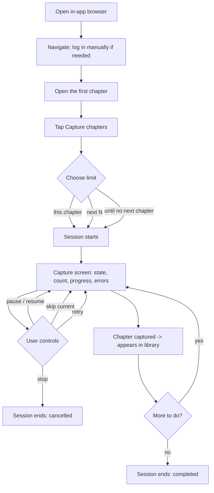
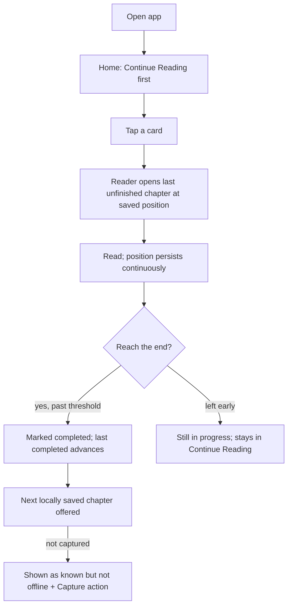

# Web Reader — Product

> Canonical product definition and the vocabulary every other doc uses.
> Status: draft, pre-implementation. Revised 2026-07-25 (working identity; vertical-slice-first
> checkpoints). Terminology here is binding on the other docs.

---

## 0. Working identity

Development identity, not a finalised public brand:

| | |
|---|---|
| **Product name** | `Web Reader` |
| **Working description** | `Archive and read web content offline` |
| **iOS bundle identifier** | `com.mcagricaliskan.webreader` |
| **Internal slug** | `webread` — used for the storage directory, the database filename, and the JS bridge namespace |

The display name and bundle identifier **may be reviewed before distribution**. Changing the display
name is cheap at any point. Changing the **bundle identifier** gets progressively more inconvenient
once signing, provisioning profiles, or any release setup exist — so if it is going to change, change
it early. Generic identifiers such as `com.example.*` are not used at any stage.

The internal slug is deliberately **decoupled from the display name**: renaming the product must never
require renaming a directory that holds user data. See [DECISIONS.md](./DECISIONS.md) D22.

Naming and branding do not block development.

---

## 1. Vision

A single app that does two things and does them durably:

1. **Autonomous capture** — you browse to a chapter in the app's own browser, tap *Capture*, and
   leave the app open. It scrolls the page like a reader would, waits for the lazily-loaded images
   and JavaScript content to actually arrive, saves the real content to disk, finds the next
   chapter, and repeats until it hits your limit or runs out of chapters.

2. **A reading library that never forgets** — what you follow, where you stopped inside a chapter,
   what you finished, what you have offline, and what the source has published since. Reorganising,
   archiving, or freeing disk space never costs you that history.

The app is a *reader's* browser. It is not a general crawler, a scraper platform, or a download
manager. Everything it does is scoped to content the user can already open themselves in the
embedded browser.

**What this is not:** universal site compatibility. The first milestone is a proof of concept that
works reliably on a handful of real chapter-based sites, with the seams in place to add
site-specific rules later.

---

## 2. Glossary

These terms are used consistently in every doc. Do not introduce synonyms.

| Term | Meaning |
|---|---|
| **Library item** | The durable tracked unit: a series, a followed site section, or a single standalone article. Owns lifecycle state, pin/favorite flags, reading pointers, and all chapters. Never destroyed by archiving. |
| **Source** | The website a library item comes from (host + entry URL). |
| **Chapter** | One unit of content inside a library item. A standalone article is a library item with exactly one chapter. Chapters can be *known* without being *captured*. |
| **Discovered** | The app knows a chapter exists on the source. No local content implied. |
| **Captured** | The chapter's content is stored locally and verified complete. |
| **Capture session** | One autonomous run: a start chapter, a limit, and a chain of chapters walked in order. |
| **Reading position / anchor** | Where inside a chapter the user stopped, in a form that survives restarts. |
| **Recipe** | Site-specific rules (selectors, next-link, quirks) keyed by host. Data, not code. Future-facing; the schema reserves it. |
| **Extractor** | A component that turns a live DOM into content (images or readable text). |
| **Next-page strategy** | A component that proposes the next chapter's URL from the current page. |
| **Update check** | A user-triggered pass that asks the source what chapters exist now. |

**The four chapter pointers** — these are separate concepts and are never collapsed:

| Pointer | Meaning | Set by |
|---|---|---|
| **Latest known** | The newest chapter the app knows exists on the source. | Discovery or update check |
| **Latest captured** | The newest chapter stored locally and complete. | Capture |
| **Last opened** | The chapter the user most recently opened in the reader. | Reader |
| **Last completed** | The newest chapter the user actually finished. | Reader / explicit mark |

Capturing a chapter never advances *last opened* or *last completed*. Discovering one never
advances *latest captured*. This separation is load-bearing — see [DATA_MODEL.md](./DATA_MODEL.md) §5.

---

## 3. Main use cases

1. **Bulk-capture a running series.** Open chapter 40, capture the next 20, read them offline over
   the week.
2. **Catch up.** Come back after a month, tap *Check for updates* on three followed series, see
   which have new chapters, capture them.
3. **Continue reading.** Open the app, tap the first card, land exactly where you stopped mid-chapter.
4. **Read a long article offline.** Capture one page, read it cleanly, keep it.
5. **Archive a finished series.** Remove it from the active library without losing that you read it,
   where you stopped, or the files.
6. **Free disk space.** Delete captured files for an archived series; keep every bit of reading
   history and metadata so it can be re-captured later.

---

## 4. Initial user journeys

### 4.1 Capture

Notes that shape the design:

- The user may have to log in, dismiss a consent banner, or solve a challenge. That is **manual**,
  in the normal browser, before capture starts. If it recurs mid-session the session pauses and asks
  — it never tries to automate it. *(Authenticated sites are supported from
  [MVP_PLAN.md](./MVP_PLAN.md) M10; the PoC targets public pages — §13.1.)*
- Successful captures land in the library **as they complete**, not at the end. A stopped session
  still leaves you with everything it finished.
- The reading pointers do not move. Capturing 20 chapters leaves *last opened* exactly where it was.

### 4.2 Reading

---

## 5. Core concepts

### 5.1 Capture is a session, not a download

A capture session is an explicit, observable, resumable process with a state machine — not a fire
and forget download. It reports what it is doing, why it is waiting, and what failed. See
[TECHNICAL_SPEC.md](./TECHNICAL_SPEC.md) §5.

### 5.2 A chapter is complete or it is not

A chapter is marked `captured` only after every required file is on disk and verified. A partial
save is `partial` or `failed`, is visible as such, and is retryable. There is no state where the app
believes it has content it does not have.

### 5.3 Local content is real content, not screenshots

Webtoon chapters store the original image files. Text chapters store cleaned HTML plus a plain-text
rendering. A raw page snapshot is a debugging fallback, never the primary format. This is what makes
the offline reader good instead of a picture viewer.

### 5.4 The library is metadata-first

The database is the source of truth for what the user follows and where they are. Files can be
deleted, re-captured, or missing; the library entry and the reading history survive all of it.

---

## 6. Product checkpoints

Two gates, in order. The first is small and proves the product's central claim; the second is the
MVP.

### 6.1 The first vertical slice — PoC checkpoint

> **The first successful vertical slice is: open one webtoon chapter, load all relevant images, save
> the actual image files locally, restart or go offline, and read the saved chapter without
> contacting the source website.**

That is the only thing the early architecture needs to enable, and it is the standard every early
design choice is judged against. Concretely, in this order, on the iOS Simulator:

1. Open one webtoon chapter in the in-app browser and start a capture.
2. The page scrolls automatically; lazy-loaded images are detected and become stable.
3. The real image files are saved locally, in reading order, with a manifest.
4. A failed download is visible and never produces a false "captured" state.
5. Quit the app. Disable network access. Reopen.
6. Read that chapter end to end from local storage, with no request to the source website.

**Nothing else is built before this works** — see §13.

Delivered by [MVP_PLAN.md](./MVP_PLAN.md) M0–M2. Multi-chapter autonomous capture (M3) closes the PoC
stage immediately after.

### 6.2 MVP checkpoint

One sitting, against at least two real chapter-based sites:

1. Browse to a chapter, tap Capture, choose "next 5".
2. Watch it capture five chapters without intervention.
3. Kill the app. Reopen it. Library still shows five chapters, plus a resumable-session card.
4. Open chapter 3, scroll halfway, background the app, kill it, reopen.
5. Continue Reading shows chapter 3; opening it lands at the same place.
6. Finish chapter 3 → *last completed* advances; chapter 4 is offered.
7. Tap *Check for updates* → newly published chapters appear as **known but not captured**, with no
   change to any read state.
8. Archive the item → it leaves the active library, keeps everything, and restores intact.

Delivered by [MVP_PLAN.md](./MVP_PLAN.md) M4–M11. Anything beyond this is Stage 2.

---

## 7. Persistent reading state

The app must preserve reading state across all of these, and this is a hard requirement, not a
best-effort:

| Event | What must survive |
|---|---|
| App restart / crash / OS kill | Position (within a few seconds of scrolling), all pointers |
| Capture session fails midway | Everything; a failed capture touches no read state |
| Library item archived | Everything; archive is a visibility flag |
| Item untouched for a year | Everything |
| Source website goes down | Everything local; only *update check* degrades |
| Local chapter files deleted to save space | All history and metadata; the chapter shows as *known, not offline* |

**Never silently discarded:** reading progress, library metadata, archive state, pin state, favorite
state, last successful source information.

The corollary: deletion is always explicit, always confirmed, and always scoped (files vs. item).

---

## 8. Continue Reading

The home screen's primary section, and the answer to "I opened the app to keep reading".

**Contents:** library items with an unfinished chapter — a chapter that is `inProgress`, or a
`completed` chapter followed by a captured chapter that is `unread`.

**Order:** most recently read first. Pinned items are surfaced above (or in their own strip — a UI
choice, see [OPEN_QUESTIONS.md](./OPEN_QUESTIONS.md) Q11).

**Card shows:** title · cover/thumbnail when available · last opened chapter label · progress within
that chapter · relative last-read time · new-chapter badge when known · an offline indicator when
the next chapter is not captured.

**Tapping it** opens the reader at the saved position. One tap from launch to reading is the bar.

Other views (MVP-relevant subset in **bold**):

| View | Contents | Default order |
|---|---|---|
| **Continue Reading** | Items with an unfinished chapter | `lastReadAt` desc |
| **Recently Read** | Any item ever read | `lastReadAt` desc |
| **Pinned** | `pinned = true` | `pinnedOrder` asc, stable |
| **New Chapters** | Active items where latest known > latest captured, or > last completed | new-chapter count desc |
| **Active Library** | `lifecycle = active` | `lastReadAt` desc |
| Dormant | `lifecycle = dormant` | `title` asc |
| Archive | `lifecycle = archived` | `archivedAt` desc |

**Sorting the model must permit** (not all shipped in the first UI): pinned order, most recently
read, recently added, recently updated, title, latest known chapter, unread known count, offline
availability.

**Filters the model must permit:** active · dormant · archived · pinned · favorite · has new
chapters · has unfinished chapter · available offline · capture failed.

---

## 9. Library lifecycle, pin, and favorite

Four independent attributes. Combining them is legal in every combination.

| Attribute | Type | Controls | Example |
|---|---|---|---|
| `lifecycle` | `active` / `dormant` / `archived` | Which library view it appears in | A finished series → `archived` |
| `pinned` | bool + optional order | Prominence and ordering | The two series you read daily |
| `favorite` | bool | User preference / taste marker | A favourite you finished years ago |
| *(derived)* offline | computed | Whether captured files exist | — |

- **active** — currently being read or followed. Included in update checks by default.
- **dormant** — kept, but not in the current rotation. Visible in its own view, not in the active
  library. Still fully searchable, still fully intact. Not update-checked by default (Q13).
- **archived** — hidden from normal browsing. Everything retained.

**A favorite item may be archived.** A pinned item is normally not archived, but nothing prevents it;
if it happens, archived wins for visibility and the pin is preserved for when it is restored.

---

## 10. Archive and deletion semantics

This is the section to point at when someone proposes a shortcut.

**Archive** behaves like archiving an email:

- Removes the item from the default active view.
- Deletes nothing: not the item, not the reading history, not the pointers, not the captured files.
- Is reversible in one tap, restoring the previous lifecycle state.

**Permanent deletion** is a separate, explicit, confirmed action, and it comes in two distinct sizes
that must never be presented as one:

| Action | Removes | Keeps | Reversible |
|---|---|---|---|
| **Free up space** | Captured files on disk | Library item, all chapters as *known*, all reading history and pointers | Yes — re-capture |
| **Delete item** | Everything: item, chapters, files, history | Nothing | No |

In the UI, *Delete item* sits apart from every other control on the series detail screen, is
destructive-styled, and requires an explicit confirmation naming the item.

**Reliability requirement:** an archived item must never be treated as deleted by any query, sweep,
migration, or cleanup job. Cleanup routines operate on files, keyed by explicit user action — never
on lifecycle state.

**As built (2026-07-27).** *Free up space* shipped as **"Remove offline files"** (D35). It is
available for one chapter, a multi-select in series detail, a whole series, and every finished
chapter at once (Storage). It removes bytes only: series, chapter rows, source URLs, ordering,
reading progress, read marks, last-read times, update-check metadata and user-edited titles all
survive, and the chapter then reads as *"Not available offline — capture again"*. Chapters that are
open in the reader or mid-capture are **kept**, and the confirmation says so rather than failing.
Single and small removals offer an Undo; bulk work runs as an Activity task with live progress.
*Delete item* remains unbuilt and out of scope.

**After finishing a chapter (D37).** A persisted preference — *Ask each time* (default) · *Keep
offline* · *Remove automatically* — applies **only** when the reader moves forward from a finished
chapter to a different, openable one. In *Ask* mode the dialog's highlighted answer is always the
preserving one, and only an explicit *"Don't ask again"* changes the stored preference. Changing the
preference never removes anything already downloaded.

---

## 11. New-chapter checking

**MVP: user-triggered only, foreground, while the app is open.** No scheduling, no background
fetch.

Every library item exposes *Check for updates*. It opens or inspects the item's saved source page in
the WebView — reusing the existing logged-in session — and compares what it finds against known
chapters.

What a check records:

- Last successful check time / last failed check time
- Last check error, when any
- Newly discovered chapters, inserted as **known, not captured**
- Latest known chapter
- **Check quality**: `complete` (a chapter list was read end to end) or `partial` (only a bounded
  forward walk succeeded, so "at least N new" is all we can claim)

What a check must **never** do: change read status, change reading position, capture anything, or
move *last opened* / *last completed*.

The UI must distinguish the four states plainly, because they look similar and mean different things:

> **new on the source** ≠ **downloaded** ≠ **opened** ≠ **finished**

Future: scheduled/background checking, batched "check all active", change detection by content hash.

---

## 12. Screens (MVP)

| Screen | Purpose | Must show |
|---|---|---|
| **Browser** | Normal browsing, login, finding the start chapter | Toolbar: Back · Forward · address (host + shortened path, tap to expand) · Refresh/Stop · **Home**. *Capture* and a page-actions menu over the page. No permanent Go — it belongs to the expanded editor. The capture control describes **this page**: Capture · Capture again (already offline) · Queued · Capturing · Downloading · Waiting for Browser — never the last job the app happened to run |
| **Browser Home** | Start somewhere, or get back to where you were | Search-or-address field · saved sites (reorderable, removable) · recently visited (bounded) · a way back to the still-open page · Full history. A **layer over** the live page, never a reload |
| **Expanded URL editor** | Read and edit a long chapter address | The whole URL on one scrolling line · Select all / Copy / Paste and go / Clear / Open host / Save site · local suggestions from saved sites and history only · Go, which also fires from the keyboard |
| **History** | Find a page again, or forget it | Date-grouped pages and hostname-grouped sites · search · per-row open / save / copy / remove visit / remove site · clear by range with the count shown first. **Only pages the user visited** — capture and update checks never appear |
| **Capture session** | Observe and control one autonomous run | Current chapter/URL · captured count vs. limit · current state · asset progress when known · retry count · last error · Pause / Resume / Retry / Skip / Stop |
| **Library / Home** | Get back to reading | Continue Reading, New Chapters, Pinned, Recently Read; entry to Active / Dormant / Archive |
| **Series detail** | Everything about one library item | Title + source · lifecycle · pin/favorite toggles · last read, last completed, latest known · unread count · last check time · *Check for updates* · *Continue reading* · *Capture more* · local chapter list · failed/incomplete captures called out · Archive/Restore · *Delete item* (separated, destructive) |
| **Capture range sheet** | Choose how much, then choose when | Current chapter · Number of chapters · Until the end, then two actions in the same sheet: **Add to Queue** (secondary) and **Start Capture** (primary). No second drawer. While something else holds the Browser, Start Capture becomes *View active task* and Add to Queue stays |
| **Capture queue** | Decide what to fetch, then fetch it | Queued requests wait · the Library shows `Capture queue · N waiting` · **Start queued captures** is the only thing that releases them · queued work survives a restart, still unstarted · a capture the user starts from the Browser runs on its own and leaves the queue exactly where it was |
| **Episode list** | Find and resume | Newest first by default with a compact sort toggle · number-first labels (`Chapter 487`) · a painted progress ring per row · long press for details |
| **Chapter (not offline)** | Get it back, or read it at the source | Tapping offers *Open on website* · *Capture again* · *Cancel* — never a dead row and never an empty reader. The chapter stays listed with its history |
| **Reader** | Read offline | Vertical webtoon view or text view · saved position · prev/next captured chapter · **swipe right to go back to the episode list** · mark read/unread · explicit banner when a chapter is incomplete/failed · explicit state when the next chapter is known but not offline |

**Capture-screen UX considerations** (documented, not implemented device-specifically in the MVP):
sessions can run for many minutes with the app open, so the screen should stay awake, dim to a
low-attention state while still showing status, and guard against accidental touches reaching the
WebView. Treat these as design requirements for M3, not as platform work now.

---

## 13. Non-goals

Two tiers. The first is about **sequencing**; the second is about **scope**.

### 13.1 Not before the vertical slice (§6.1)

These are real MVP features, deliberately deferred until one chapter can be captured and read
offline. Building any of them earlier delays the only question that matters:

Cloud synchronisation · remote crawling · scheduled checks · **login support and authenticated
sites** · novel / text extraction · broad library organisation (pin, favorite, dormant, archive) ·
advanced reading-progress behaviour.

Login in particular is **not** the first product risk: most initial target sites are public, so
authentication is scheduled at [MVP_PLAN.md](./MVP_PLAN.md) M10, after public-page capture works.

### 13.2 Excluded from the MVP entirely

Proposing any of these is a scope change, not a detail:

Cloud storage · user accounts · cross-device sync · remote crawler workers · scheduled background
crawling · scheduled background update checking · browser extensions · desktop app · Flutter Web
reader · AI-based extraction · CAPTCHA bypass · DRM bypass · paywall bypass · anti-bot bypass ·
public recipe marketplace · universal site compatibility · automated login · App Store production
readiness.

**Included despite sounding adjacent:** manual update checking while the app is open, and manual
login inside the WebView at M10 (the app never handles credentials itself).

**Standing constraint:** the app operates only on pages the user can normally open in the embedded
browser, with their own session. It does not circumvent access controls of any kind. Politeness
(serial navigation, a delay between chapters) is a product requirement, not just a nicety.

---

## 14. Future possibilities

Listed so the seams stay honest. None of these are designed in detail, and none may complicate the
MVP.

- Cloud backup of the library database; cross-device sync of reading position.
- Reading on a PC / desktop app / Flutter Web reader over the local library.
- Remote capture workers so the phone need not stay open.
- Scheduled background update checks and background capture.
- A browser extension for capture-from-desktop.
- User-editable site recipes; later, a shared recipe library.
- Better extraction: content-type-specific extractors, ML-assisted region detection.
- Export: EPUB, CBZ; full-text search; annotations; advanced typography.
- Content deduplication across items; smarter storage compaction.

---

## 15. Success criteria

**Functional**

1. Five consecutive chapters captured unattended on two different real sites.
2. Zero chapters marked `captured` that are not fully readable offline.
3. Reading position survives force-quit with at most a few seconds of scrolling lost.
4. Archive → restore round-trips with no metadata loss.
5. An update check finds new chapters without altering a single read-state field.

**Behavioural**

6. Launch → reading again in one tap from Continue Reading.
7. When capture fails, the user can tell *what* failed and *why* from the capture screen alone.

**Structural**

8. Adding support for a new site means adding a recipe or one extractor implementation — not
   editing the capture orchestrator.
