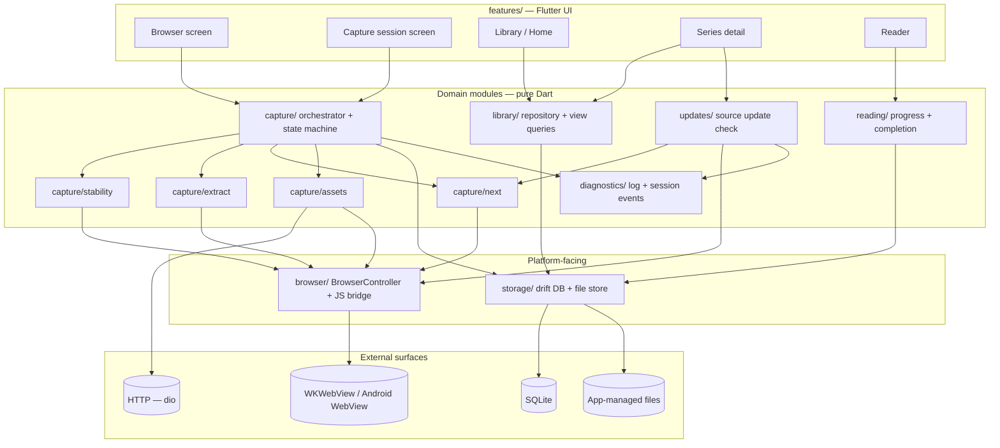
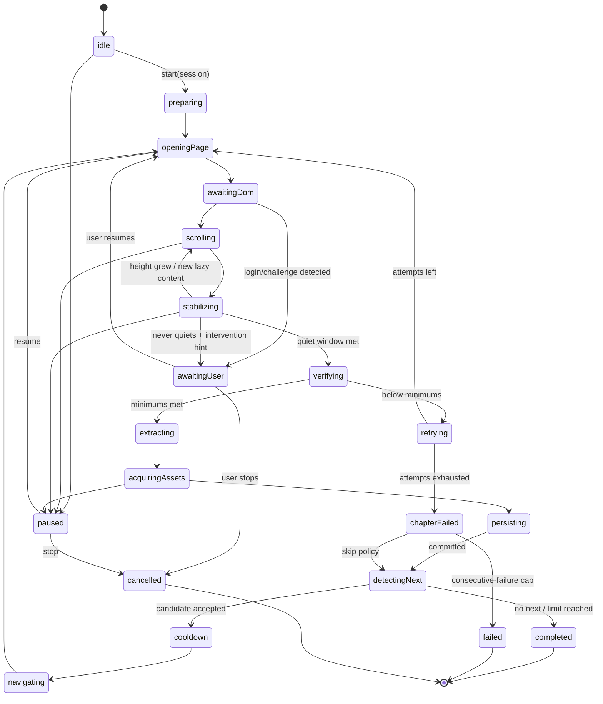
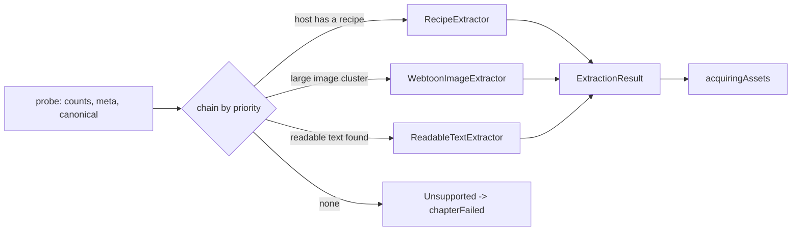
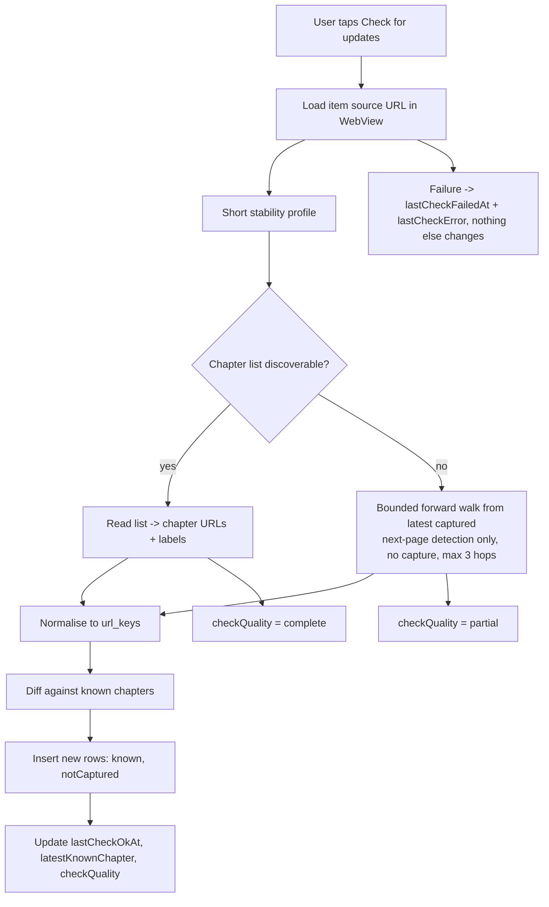

# Web Reader — Technical Spec

> How the thing works. Read [PRODUCT.md](./PRODUCT.md) first for vocabulary.
> Status: design, pre-implementation. Revised 2026-07-25. Package **choices** are decisions; package
> **versions** are not — see §2. Algorithm constants are starting points to be tuned, not
> measurements.

**Observed local toolchain (2026-07-25, not pinned):** Flutter 3.44.0 stable · Dart 3.12.0 ·
Xcode 26.6 · iOS 26.5 Simulator runtime available.

**The yardstick for every design choice below:**

> Open one webtoon chapter, load all relevant images, save the actual image files locally, restart or
> go offline, and read the saved chapter without contacting the source website.

If a component in this document is not needed for that flow, it belongs to a later milestone —
[MVP_PLAN.md](./MVP_PLAN.md) says which. The architecture is described whole so the seams are right;
it is **not** all built at once.

---

## 1. Technical overview

A single-process Flutter app. One embedded WebView does double duty: it is the user's browser *and*
the capture engine's execution environment. Capture logic lives in Dart and drives the page through
an injected JavaScript bridge; the DOM work happens in the page, where the live post-JavaScript DOM
actually is.



**Layering rule, enforced by review:**

- `features/*` may import domain modules. Domain modules may not import `features/*`.
- `browser/` is the **only** module that imports `flutter_inappwebview`.
- `storage/` is the **only** module that imports `drift`.
- `capture/` never touches Flutter widgets and is unit-testable against fakes for
  `BrowserController` and `ChapterStore`.

**Why the layering is worth it here:** the WebView plugin and the database are the two dependencies
most likely to be swapped (plugin maintenance risk; a future sync-capable store). Everything else is
kept ordinary — no repository interfaces over interfaces, no dependency-injection ceremony beyond
Riverpod providers.

### Proposed source layout

```
lib/
  app/            bootstrap, router, theme
  core/           ids, Result/failure types, URL normalisation, clock, throttle
  browser/        BrowserController, JsBridge, injected/*.js, cookie + UA access
  capture/        session state machine, orchestrator, policies, session store
    stability/    page-stability detector (Dart side of the JS driver)
    extract/      ContentExtractor interface + webtoon / readable-text / recipe impls
    next/         NextPageStrategy chain + candidate validation
    assets/       AssetFetcher (dio primary, in-page fallback), staging writes
  storage/        drift database, DAOs, migrations, FileStore (paths, staging, commit)
  library/        LibraryRepository, view queries, lifecycle operations
  reading/        progress tracking, completion rules, pointer maintenance
  reader/         webtoon reader, text reader
  updates/        SourceUpdateChecker, ChapterListDiscovery
  diagnostics/    structured capture log, session event feed, redaction, export
  features/       screens
assets/js/        readability.js (vendored), webread_bridge.js
```

### Pure Dart vs. native

| Area | MVP | Notes |
|---|---|---|
| Capture orchestration, state machine, extraction logic, next-page, progress, library | Pure Dart | Fully unit-testable without a device |
| WebView control + JS bridge | Plugin (Dart API) | No custom native code needed |
| Asset download | Pure Dart (`dio`) | |
| Database + files | Pure Dart (`drift`, `dart:io`) | |
| **Exclude-assets-from-iCloud-backup** | **Small native call needed** | `NSURLIsExcludedFromBackupKey` on iOS; ~20 lines of platform channel. Not needed for the PoC; scheduled with M11. |
| Free-disk-space query | Deferred | Needed for the low-disk guard; a platform channel or a small package. MVP can use a soft "write failed" path instead. |
| Background execution | **Not in MVP** | iOS suspends WKWebView JS shortly after backgrounding; foreground-only is a platform fact (§13). |
| Android foreground service | Future | Only if background capture is ever pursued. |

---

## 2. Recommended packages

**Package choices are decisions. Package versions are not.** This section names *what* to depend on
and why. It deliberately records **no version constraints** — a version number written here would
harden into a false architectural commitment within weeks.

### 2.1 Version policy

At implementation time (M0), and again whenever a dependency is added:

1. Resolve the **latest stable, mutually compatible** versions available *then*, against the project's
   Flutter/Dart SDK.
2. Prefer current stable releases. Avoid prereleases unless a required capability exists only there —
   and if so, record which capability, in [DECISIONS.md](./DECISIONS.md).
3. **Do not add deprecated or end-of-life compatibility packages.** Concrete live example: as of
   2026-07-25, `sqlite3_flutter_libs` is published as `0.6.0+eol` and is an empty no-op —
   `package:sqlite3` 3.x now bundles SQLite through Dart build hooks. Adding it would be adding a
   tombstone. Re-check this class of thing rather than copying a dependency list forward.
4. **Commit `pubspec.lock`** so builds are reproducible regardless of when they run.
5. If a resolved version forces an architectural limitation — a missing API, a platform gap, a
   behaviour change — record it as a decision entry, not as a comment in `pubspec.yaml`.

The observations in the table below (which APIs exist, which platforms they cover) were verified from
package sources on **2026-07-25**. Treat them as *re-verifiable claims*, not as guarantees about
whatever version resolves later.

### 2.2 The packages

| Package | Role | Why *this* one |
|---|---|---|
| **`flutter_inappwebview`** | WebView + JS bridge | Two capabilities decide it against the official `webview_flutter`. **(a) User scripts.** Our bridge must exist *before* page scripts run and must survive every navigation. `flutter_inappwebview` registers a `UserScript` at `atDocumentStart` and re-injects it automatically. `webview_flutter` uses `WKUserScript` internally but exposes **no public API** for it — you would re-inject from `onPageStarted`, racing the page's own scripts. **(b) Async JS calls with arguments.** `callAsyncJavaScript(functionBody:, arguments:)` passes a JSON argument map and **awaits a returned promise**; `runJavaScriptReturningResult` evaluates a snippet, returns its immediate value, and forces string-interpolating URLs and selectors into JS source. Every bridge call we make is async and parameterised. Also useful: `ContentWorld` isolation, `HeadlessInAppWebView`, `shouldOverrideUrlLoading`, `onUpdateVisitedHistory`. *Not differentiators — both plugins have them (verified 2026-07-25): `getCookies` and `setInspectable`.* **Risk:** effectively single-maintainer. **Mitigation:** reachable only through our `BrowserController` interface, so a swap is one file plus the injected JS. |
| **`drift`** + **`drift_flutter`** | Local database | SQLite with codegen'd typed queries, real migrations with schema-version tests, transactions, indexes, and `.watch()` streams that map 1:1 onto the reactive library views. Raw SQL is available where the ordering queries want it. See §10 for the alternatives considered. |
| `drift_dev`, `build_runner` | dev | dev-only codegen. |
| **`dio`** | Asset download | Asset download needs per-request headers (Referer/Cookie/UA), streamed-to-disk responses, byte progress callbacks, and cancellation. `package:http` has none of the last three ergonomically. Also the house HTTP client in `astrolith-mobile`. |
| **`path_provider`** | App directories | `getApplicationSupportDirectory()` — the correct home for app-managed, re-downloadable content. |
| `path` | Path joining | Path joining. Never string concatenation for file paths. |
| **`uuid`** | IDs | Client-generated v4 IDs for every row. Stable IDs now cost nothing and are the precondition for any future sync. |
| **`crypto`** | Hashing | SHA-256 content hashes: duplicate-chapter detection and asset integrity. |
| **`flutter_riverpod`** | State | House stack. `StreamProvider` over drift `.watch()` gives reactive library views with no glue. The capture session's state stream fits the same shape. |
| **`go_router`** | Routing | House stack; deep-link-ready routing to a chapter, which the reader needs anyway. |
| **`wakelock_plus`** | Keep screen awake | A capture session is long and foreground-only; the screen must not sleep. One narrow purpose, actively maintained. |
| `collection` | Utilities | Grouping/scoring helpers in the extractor. |

**Vendored, not a package:** `mozilla/readability` (`readability.js`) as a bundled asset, injected
into the page for text extraction. It is the reference implementation of the algorithm and runs
where the live DOM is. `[Unverified]` licence is Apache-2.0 — confirm before vendoring; if that is
wrong, the fallback is our own heuristic extractor (§7.3).

**Deliberately not added, with reasons:**

| Rejected | Why |
|---|---|
| A state-machine package (`statemachine`, `bloc` as an FSM) | Our machine is ~15 states with side effects and persistence. Dart 3 sealed classes give exhaustive `switch` with compile-time checks in ~150 lines we fully control. A library would add vocabulary without removing work. |
| `package:html` (Dart DOM parser) | It parses fetched HTML. We need the **post-JavaScript live DOM**, which only exists in the WebView. Parsing in Dart would silently miss exactly the lazy content this app exists to capture. |
| `flutter_html` | Heavy, historically lossy on real-world markup. The text reader renders in a WebView we already have — better fidelity, and the same JS bridge gives us scroll anchoring. |
| `freezed` / `json_serializable` | Sealed classes, records, and hand-written `toJson` cover the small number of serialised types (manifest, progress anchor). Revisit if boilerplate becomes real. |
| `sqflite` | No typed queries, no reactive streams — see §10. |
| `sqlite3_flutter_libs` | **`0.6.0+eol` — the package is deprecated and now empty.** `package:sqlite3` 3.x bundles SQLite through Dart build hooks; `drift_flutter` depends on the EOL marker only to prevent the old build scripts. Do not add it directly. *[Verified 2026-07-25 from the local pub cache.]* |

---

## 3. Component responsibilities

| Component | Owns | Explicitly does not |
|---|---|---|
| `BrowserController` | Loading URLs, load/navigation events, JS evaluation, cookie + UA access, current URL | Know what a chapter is |
| `JsBridge` | Injected script lifecycle, request/response correlation, event stream from page → Dart | Contain site logic |
| `CaptureOrchestrator` | Driving the state machine, sequencing steps, retry accounting, session persistence | DOM work, file I/O details |
| `CaptureStateMachine` | Legal transitions, terminal states | Side effects (the orchestrator performs them) |
| `PageStabilityDetector` | Deciding "the page has stopped changing" | Deciding what content matters |
| `ContentExtractor` (chain) | DOM → `ExtractionResult` (URLs, text, metadata). No I/O | Downloading bytes |
| `AssetFetcher` | Bytes → staging files, with cookies/Referer, retries, fallback path | Deciding which assets |
| `ChapterStore` | Staging dir, atomic commit, manifest write, path resolution, deletion | Database state |
| `NextPageStrategy` (chain) | Proposing a next URL with a confidence | Navigating |
| `NextCandidateValidator` | Loop, scope, and duplicate rejection | Proposing |
| `SourceUpdateChecker` | Manual update-check pipeline, check-quality reporting | Capturing |
| `ReadingProgressTracker` | Throttled persistence, completion rules, pointer maintenance | Rendering |
| `LibraryRepository` | Reactive view queries, lifecycle/pin/favorite operations | Capture |
| `CaptureLog` | Structured, bounded, redacted diagnostics | |

Interface sketches — the seams that matter, in the shape they should take:

```dart
abstract interface class BrowserController {
  Future<void> load(Uri url);
  Stream<PageEvent> get events;                 // loadStart, loadStop, urlChanged, error
  Future<T> call<T>(JsCall<T> call);            // typed, over callAsyncJavaScript
  Stream<BridgeEvent> get bridgeEvents;         // page -> Dart pushes
  Future<Uri?> get currentUrl;
  Future<String> get userAgent;
  Future<List<Cookie>> cookiesFor(Uri url);
}

abstract interface class ContentExtractor {
  int get priority;                              // recipe > webtoon > text > fallback
  Future<bool> canHandle(PageProbe probe);
  Future<ExtractionResult> extract(BrowserController b, PageProbe probe);
}

abstract interface class NextPageStrategy {
  NextConfidence get confidence;                 // high | medium | low
  Future<NextCandidate?> find(BrowserController b, CaptureContext ctx);
}

abstract interface class ChapterStore {
  Future<StagingHandle> beginChapter(String libraryItemId, String chapterId);
  Future<void> writeAsset(StagingHandle h, int index, String name, Stream<List<int>> bytes);
  Future<void> writeText(StagingHandle h, String fileName, String content);
  Future<CommittedChapter> commit(StagingHandle h, ChapterManifest manifest);
  Future<void> discard(StagingHandle h);
  Future<void> deleteContent(String libraryItemId, String chapterId); // keeps DB rows
}
```

---

## 4. WebView and JavaScript bridge

### 4.1 One WebView, shared

Manual browsing and capture use the **same** `InAppWebView` instance and the same default website
data store.

Two reasons, in order of when they bite:

1. **Now:** capture runs in exactly the environment the user browsed in — same cache, same cookies,
   same UA, same consent-banner state. A second WebView would introduce a class of "works when I
   browse, fails when it captures" bugs for no benefit.
2. **From M10:** it is the only way a manual login carries into capture. An incognito or
   second-store WebView would lose the session.

Corollary, in force from day one even though authentication is an M10 concern: `incognito` stays
`false`, and no code path clears website data implicitly.

Capture keeps the WebView **visible and attached** for the MVP. `HeadlessInAppWebView` exists and is
supported on iOS, but offscreen WKWebViews can have layout, rendering, and `IntersectionObserver`
behaviour that differs from attached ones — exactly the mechanisms lazy-loading relies on. Visible
also gives the user a live view of what the session is doing, and a place to intervene. Headless is
a post-MVP optimisation to evaluate with measurements (see [OPEN_QUESTIONS.md](./OPEN_QUESTIONS.md) Q02).

Baseline settings:

```
javaScriptEnabled: true
incognito: false
cacheEnabled: true                  // asset re-fetch usually hits the WebView cache
mediaPlaybackRequiresUserGesture: true
useOnLoadResource: false            // noisy; not needed on the primary path
isInspectable: kDebugMode           // iOS 16.4+ requires opt-in for Safari Web Inspector
transparentBackground: false
```

### 4.2 The bridge

Two directions, both narrow:

- **Dart → page:** `callAsyncJavaScript(functionBody:, arguments:)`. The body is an async function;
  arguments are passed as JSON. This gives promise-awaiting and typed-ish returns.
  *(Available iOS 14.3+ / Android 21+ per the plugin's own docs — fine for our floor.)*
- **Page → Dart:** `window.flutter_inappwebview.callHandler('webread', payload)` for events the page
  pushes: scroll progress, mutation-quiet notifications, image-load counts, asset chunks.

`webread_bridge.js` is registered as a `UserScript` at **document start**, main frame only, so it is
present before page scripts run and re-injects itself on every navigation automatically. It defines
one global namespace and nothing else:

```js
window.__webread = {
  version: 1,
  probe(),               // -> {contentType hints, counts, title, canonical, height}
  startScroll(opts),     // begins the scroll driver; reports progress via callHandler
  stopScroll(),
  stability(opts),       // installs MutationObserver + samplers; resolves when quiet or times out
  collectImages(opts),   // -> ordered candidate assets with intrinsic sizes
  extractReadable(),     // Readability over a DOM clone
  findNext(opts),        // -> ranked next-page candidates
  discoverChapters(opts),// -> chapter-list links for update checks
  fetchAssetChunk(url, offset, size), // fallback in-page byte transfer
};
```

Design constraints on the injected script:

- **Never mutate the live DOM.** Readability rewrites the document, so it always runs on
  `document.cloneNode(true)`. Mutating the page would break scroll position, lazy loading, and any
  subsequent extraction attempt.
- **Idempotent.** Re-invoking any function on the same page must be safe; a retry re-invokes.
- **Abortable.** The scroll driver polls a flag so Dart can stop it mid-run.
- **Versioned.** `version` is written into every chapter manifest as `captureVersion`, so a
  re-capture after a bridge change is identifiable.
- **Isolated where possible.** Run in a separate `ContentWorld` so page scripts cannot see or clobber
  our globals. `[Assumption]` this is available and behaves on both platforms; if a site breaks, fall
  back to the page world with an obfuscated namespace.

### 4.3 The scroll driver lives in the page

Scrolling from Dart would mean one bridge round-trip per step — slow, and it interleaves badly with
the page's own scroll handlers. Instead the page runs the loop and reports progress; Dart owns
start/stop and the overall timeout. Fewer round-trips, and the scroll looks to the site like an
ordinary user scroll (which is what triggers `IntersectionObserver`-based lazy loaders).

---

## 5. Capture state machine

**Built in two passes.** M1g implements only the single-page path —
`openingPage → awaitingDom → scrolling → stabilizing → verifying → extracting → acquiringAssets →
persisting → completed | chapterFailed`. M3 adds the multi-chapter states (`detectingNext`,
`cooldown`, `navigating`, `paused`, `awaitingUser`, `retrying`) and session persistence. The whole
machine is documented here so that the second pass is an extension rather than a rewrite — which is
the entire reason for choosing a state machine over a procedure at M1.

### 5.1 States



`paused`, `awaitingUser`, and `cancelled` are reachable from every non-terminal state; the diagram
shows representative edges only.

### 5.2 Renames from the brief, and why

| Brief | Here | Reason |
|---|---|---|
| `idle` | `idle` | — |
| — | **`preparing`** | Resolve/create the library item and the session row *before* touching the WebView, so a crash one second in still leaves a coherent session. |
| `openingPage` | `openingPage` | — |
| `waitingForDom` | `awaitingDom` | — |
| `scrolling` | `scrolling` | — |
| `waitingForAssets` | **`stabilizing`** | The wait is not asset-specific. It covers DOM mutations, document height, *and* image completion as one quiescence check. Calling it "waiting for assets" led to two separate waits that raced. |
| `verifyingPage` | `verifying` | — |
| `extractingContent` | `extracting` | Now strictly DOM → metadata + URLs. No I/O. |
| — | **`acquiringAssets`** | Split out because it is the slowest and most failure-prone step, needs its own retry accounting, per-asset progress, and a distinct fallback path. Folding it into extraction made failures unattributable. |
| `savingContent` | `persisting` | Staging → atomic commit → DB transaction. |
| `findingNextPage` | `detectingNext` | — |
| — | **`cooldown`** | An explicit, configurable delay between chapters. Politeness and rate-limit avoidance; also a natural place to check limits and user input. |
| `navigatingToNextPage` | `navigating` | — |
| `paused` | `paused` | User-initiated. |
| — | **`awaitingUser`** | Recoverable but not automatable: login lost, a challenge page, an ambiguous next link. Distinct from `paused` (user chose) and `failed` (dead). Surfaces the WebView for manual action, then resumes. |
| — | **`retrying`** | Explicit so the UI can honestly show "attempt 2 of 3" instead of appearing stuck. |
| — | **`chapterFailed`** | A *chapter* failure is not a *session* failure. Separating them is what allows Skip. |
| `completed` / `failed` / `cancelled` | same | Each carries a reason: `completed(limitReached \| endOfChain \| loopDetected)`, `failed(consecutiveFailures \| storage \| fatal)`. |

### 5.3 Session record and limits

A session persists: id, library item, start URL, limit (`{ kind: single \| count \| untilEnd, value }`),
current state, current URL, current chapter id, captured count, consecutive-failure count, attempt
count for the current step, created/updated/finished timestamps, last error.

Written on **every state transition**. The cost is one small SQLite UPDATE per transition — a few per
chapter. Irrelevant next to a page load, and it is what makes recovery honest.

Additional hard bounds, all configurable, all with sane defaults:

| Bound | Default | Purpose |
|---|---|---|
| `maxChapters` per session | 50 | Backstop for `untilEnd` |
| `maxConsecutiveFailures` | 3 | Stop a session that is systematically broken |
| `perChapterAttempts` | 3 | Bounded retry |
| `chapterHardTimeout` | 180 s | No page can hold a session forever |
| `cooldownBetweenChapters` | 1500 ms | Politeness |

---

## 6. Page-stability algorithm

The core claim this app rests on: **a WebView load-complete callback tells you nothing about whether
the content is there.** `onLoadStop` fires when the document finished loading, before lazy images,
before framework hydration, before infinite-scroll injection. Everything below exists because of that.

### 6.1 Signals

Installed once per page, in the page:

1. **MutationObserver** on `document.documentElement`, `{childList, subtree, attributes:true,
   attributeFilter:['src','srcset','style','class','data-src']}`. Records a timestamp of the last
   *relevant* mutation (node added/removed, or an image-source attribute changed). Irrelevant chatter
   (analytics divs, timers writing text) is filtered by ignoring mutations inside `script`, `style`,
   and nodes matching an ad/tracker selector deny-list.
2. **Document height sampler** — `documentElement.scrollHeight` at a fixed interval; records the last
   change.
3. **Image tracker** — for candidate images (`naturalWidth` above a threshold or still unresolved):
   `pendingCount = images.filter(i => !i.complete || i.naturalWidth === 0).length`, plus a count of
   images that transitioned to complete since the last sample. `error` events are counted separately
   as `failedCount`.

### 6.2 The rule

```
scrollPass():
  while not atBottom and steps < maxSteps and not aborted:
     scrollBy(0.8 * viewportHeight)
     wait(scrollInterval)
     report progress

stable() is TRUE when, continuously for `quietWindow` ms:
     no relevant mutation observed
  && scrollHeight unchanged
  && pendingImages == 0
  && no image completed
AND at least one scroll pass reached the bottom
AND elapsed < hardTimeout
```

Then a **second scroll pass** runs from the top. Many lazy loaders only fire on a *downward* scroll
into the viewport, and a first pass that outran the loader leaves holes. The second pass is cheap and
catches them. If the second pass produces new pending images, `stable()` is re-evaluated.

### 6.3 Starting constants

Tunable via a `StabilityProfile`; these are guesses to be measured against real sites (Q03).

| Parameter | Default | Note |
|---|---|---|
| `scrollStep` | 0.8 × viewport | Overlap avoids skipping a lazy trigger |
| `scrollInterval` | 250 ms | |
| `quietWindow` | 1200 ms | The single most important knob |
| `maxScrollPasses` | 2 | |
| `perPassTimeout` | 45 s | |
| `hardTimeout` | 120 s | Then: extract what exists, or fail |
| `minImageEdge` | 300 px | Below this an image is chrome, not content |

**As built (2026-07-27, adaptive traversal — D33).** The careful pace above
is now only the *slow lane*. When everything within
`(1 + fastStepViewports + lookaheadViewports)` viewports below the position
is resolved and the document height is standing still for
`fastModeAfterStableProbes` consecutive probes, the engine jumps
`fastScrollStepViewports` (3.5) per step with `fastScrollDelay` (70 ms);
any nearby pending image, height change, frozen scroll, or bottom proximity
drops it straight back to careful. The stopping contract (quiet period +
stable checks at bottom + second pass on growth) is unchanged. The lookahead
deliberately exceeds the jump so a leap can never clear ground the loader
has not covered. Two further as-built guards: a **zero-viewport surface**
(hidden WebView) holds the run in `waitingForBrowser` instead of scrolling
(D32), and the pending-asset wait only waits for images plausibly content-
sized — a comment avatar stuck loading forever does not spend
`maxAssetWait`. Measured effect: uzaymanga ch885 scroll 47 s → single-digit
seconds; Asura ch137 ~88 s → seconds (live-verified; see CLAUDE.md matrix).

#### 6.3a Leaving the Browser mid-capture *(as built, 2026-07-27)*

The render guard (§6.3, D32) handles a WebView that goes unrendered *without
warning*. The complementary case is the user deliberately navigating away.

`CaptureJobController.needsRenderedBrowser` is true only for phases that
actually measure or drive layout — inspecting, scrolling, waiting for page
assets, verifying, extracting, detecting the next link, navigating. It is
false while downloading or committing (bytes over HTTP touch no layout), when
nothing is running, and when the run is already paused.

When it is true, every exit from the Browser — bottom nav, system back, and
route pushes to Settings / Activity / Storage / Archived / Rules — is fronted
by `LeaveBrowserGuard` and confirms first. *Leave and pause* holds the phase,
persists `capture_jobs.pause_reason = browserHidden`, and keeps the queue task
active; the strip and Activity both show the hold with an *Open Browser*
action. Returning clears the pause and lets the engine's own render guard
re-validate the surface and the page before work continues.

## 6.4 Infinite scroll

Detected as: `scrollHeight` growing past `initialHeight × 4`, or step count exceeding `maxSteps`
(default 400), without ever reaching a stable bottom. Response: stop scrolling, extract what is
loaded, and mark the chapter **`partial`** with reason `infiniteScroll`. Never mark it `captured` —
the user must be able to see that the page did not end.

### 6.5 Verification gate

Before extraction is allowed:

| Content type | Gate |
|---|---|
| Webtoon | `assets >= minAssets` (default 3) **and** `failedImages / totalCandidates <= 0.1` |
| Text | `textContent.length >= minChars` (default 400) |
| Either | The page is not a recognised login/challenge/error page (marker check) |

Below the gate → `retrying` (reload once, then a full re-scroll). Still below → `chapterFailed` with
an explicit reason, never a silent partial.

---

## 7. Extraction pipeline



`ExtractionResult`: content type · title · series title · chapter label + parsed number ·
canonical URL · ordered assets (url, intrinsic size, DOM index) · cleaned HTML · plain text ·
confidence · diagnostics.

### 7.1 Probe

One JS call returning cheap signals: counts of images by size bucket, total text length of the
largest text block, `<link rel=canonical>`, `og:*` metadata, `document.title`, `h1`, page height,
and whether known login/challenge markers are present. The chain uses this to decide without running
every extractor.

### 7.2 Webtoon image extractor

1. Collect every `img` (including inside `picture`). Resolve the URL as
   `currentSrc || src || data-src || data-original || largest candidate in srcset`. `currentSrc` is
   preferred because it is the URL the browser actually chose after `srcset`/media-query resolution.
2. Also collect elements with a CSS `background-image` whose box is content-sized (some readers do
   this).
3. Filter: intrinsic width and height ≥ `minImageEdge`; drop images inside `header`, `footer`, `nav`,
   `aside`, or matching the ad/tracker deny-list; drop extreme banner aspect ratios unless they belong
   to the dominant cluster.
4. **Cluster** by nearest common ancestor. Score each cluster by `count × total pixel area`. Take the
   winner if it has ≥ 3 images; otherwise fall back to whole-page order and lower the confidence.
5. Order by DOM order (`compareDocumentPosition`), not by URL or filename — filenames lie.
6. Emit absolute URLs plus intrinsic dimensions (used later to verify what we downloaded is what the
   page displayed).

### 7.3 Readable-text extractor

1. Inject vendored `readability.js`; run it against `document.cloneNode(true)` — Readability mutates
   its input, so the live DOM must never be passed.
2. Take `{title, byline, siteName, content (HTML), textContent, excerpt, length}`.
3. **Sanitise** the returned HTML before storage: drop `<script>`, `<iframe>`, `<object>`, `<embed>`,
   `<form>`, every `on*` attribute, and `javascript:` URLs. This matters because we render this HTML
   later (§14).
4. Rewrite inline `img` sources to placeholders; their URLs join the asset list and are rewritten to
   relative paths at commit time.
5. Reject below `minChars` → the chain falls through.
6. Fallback if Readability cannot be vendored: pick the densest text container by
   `textLength / (linkTextLength + tagCount)` — a simplified version of the same idea, lower quality,
   good enough to not block.

### 7.4 Recipe extractor (schema reserved, not built in MVP)

A recipe is a row keyed by host pattern: content selector, image selector, next selector, title
selector, quirk flags. `RecipeExtractor` sits at the top of the chain and short-circuits everything
below when a recipe matches. Building the *interface* now is what keeps it cheap later; building the
recipe *editor* is Milestone 2+.

### 7.5 Asset acquisition

Two paths, in order:

**Primary — Dart-side (`dio`):** GET each asset with `Referer: <chapter URL>`,
`User-Agent: <the WebView's own UA>`, and `Cookie:` built from `CookieManager.getCookies(url)`.
Stream directly to the staging file. Verify: HTTP 200 · `content-type` starts with `image/` (or the
bytes' magic number matches) · size ≥ `minAssetBytes` (default 1 KB) · decoded dimensions within
tolerance of the intrinsic dimensions the DOM reported. Concurrency 3, 2 retries with backoff.

**Fallback — in-page fetch:** on 401/403/empty/decode failure, ask the page to
`fetch(url, {credentials:'include'})`, read the blob, and transfer it to Dart in base64 chunks over
the bridge. Slower and memory-hungry (~33 % encoding overhead) but it inherits the page's exact
credential, Referer, and cache context, which defeats most hotlink protection.

**The fallback's own hard limit: CORS.** Webtoon assets usually live on a separate CDN origin. An
in-page `fetch` to a cross-origin URL is only *readable* if that CDN sends
`Access-Control-Allow-Origin`. Without it the request is blocked; `mode: 'no-cors'` returns an opaque
response whose bytes cannot be read; and the canvas route (`drawImage` → `toDataURL`) is closed for
the same reason, because a cross-origin image without `crossorigin` taints the canvas. So:

| Asset origin | Direct `dio` | In-page `fetch` |
|---|---|---|
| Same origin as the page | works | works |
| Cross-origin CDN, no hotlink protection | works | blocked unless CORS-permissive — but not needed |
| Cross-origin CDN, Referer/cookie-gated | fails | blocked unless CORS-permissive |

The third row is the one that can have **no working path on iOS**, since resource interception is
unavailable there. If a candidate site falls into it, that site is not supportable at M1 — pick a
different fixture rather than degrading to screenshots (which would contradict D08). Establish which
row the chosen site is in early; it is a five-minute check in the Web Inspector's network tab.

**Why not resource interception:** `shouldInterceptRequest` — the "grab the bytes the WebView already
downloaded" approach — is **Android and Windows only** in `flutter_inappwebview 6.1.5`
*[Verified 2026-07-25 from the plugin's platform-interface source]*. iOS offers only
`WKURLSchemeHandler`, which does not apply to `https:`. Since this is iOS-first, interception cannot
be the primary path. It stays available as an Android-only optimisation later.

Images are stored **as downloaded**. No transcoding, no re-encoding to WebP: transcoding costs CPU,
loses fidelity, and creates a second source of truth for "is this asset correct".

---

## 8. Next-page detection

A chain of strategies, each returning a candidate with a confidence. First accepted candidate wins;
all candidates are logged so a wrong pick is diagnosable.

| # | Strategy | Confidence | Notes |
|---|---|---|---|
| 1 | Recipe selector for the host | high | Reserved for post-MVP recipes |
| 2 | `<link rel="next">` / `<a rel="next">` | high | Standards-based, rare but exact |
| 3 | Labelled control | medium | `a`/`button` whose text, `aria-label`, `title`, or class matches a next-pattern list — `next`, `next chapter`, `sonraki`, `próximo`, `次へ`, `다음`, `›`, `→`. Multilingual list, extendable. |
| 4 | Chapter-list ordering | medium-high | Find a chapter list or `<select>`, locate the current chapter by URL match, take the following entry. Strong when present because it also gives ordering. |
| 5 | Generic link heuristic | low | A link whose URL differs from the current one only in a numeric segment **and** which appears near other navigation controls. |
| 6 | URL numeric increment with no link | **off by default** | Fabricating URLs produces 404 chains and phantom chapters. Opt-in per recipe only. |

### 8.1 Candidate validation

Every candidate must pass all of these before navigation:

- Absolute, `http`/`https` only.
- Same registrable domain as the library item's source (or an explicit per-item allowlist).
- Its `url_key` ([DATA_MODEL.md](./DATA_MODEL.md) §6) is not in this session's visited set.
- Its `url_key` differs from the current page's.
- It is not an already-captured chapter of this item, unless the user asked to re-capture.
- It does not match the deny patterns: `/login`, `/signin`, `/logout`, `/register`, `#`, `javascript:`.

**Post-navigation validation:** after the load settles, re-normalise the *landed* URL (redirects
happen) and re-check the visited set. A redirect back to a visited page ends the session with
`completed(loopDetected)` rather than looping.

**Content-level loop guard:** if the newly extracted content hash equals the previous chapter's,
treat it as a duplicate — do not store it, end with `completed(loopDetected)`.

**Ambiguity:** if two strategies at the same confidence disagree, MVP takes the earlier strategy and
logs both. Post-MVP, `awaitingUser` can present the choice (Q05).

---

## 8a. The capture queue (as built, 2026-07-28)

Capture is **queue-first**: adding a request and starting one are two separate
acts (D46).

```mermaid
flowchart LD
    A[Any capture entry point] --> B[queued — waiting to start]
    B -->|user presses Start Capture| C[ensureBrowserVisible]
    C -->|Browser not up| B
    C -->|attached| D[inspecting / scrolling / extracting]
    D -->|panel URLs + next link extracted| E[downloading / saving]
    E --> F[completed]
    D -->|surface lost| G[waitingForBrowser]
    G -->|Browser reopened| D
```

**Who waits.** `taskWaitsForExplicitStart` — capture only. Update checks and
cleanup drain on their own; they are bounded and already one-action-one-intent.
A queued capture is *skipped* by the pump, never a roadblock for a check
behind it.

**Authorisation is in memory, not in the row.** Queued rows persist across a
relaunch; the permission to drive the Browser does not (Q24). A drained
capture queue revokes its own authorisation, so a later addition needs a new
Start.

**Browser routing.** The queue calls `ensureBrowserVisible` before any
Browser-dependent task. The shell implements it: switch to the Browser tab,
wait for the WebView to attach. A false return leaves the task queued. The
capture engine's zero-viewport guard (D32) still applies on top — this is the
navigation, that is the proof.

**When the Browser stops being required.** `needsRenderedBrowser` covers
inspecting, scrolling, waiting for assets, verifying, extracting, detecting
next and navigating. Downloading and saving read bytes over HTTP and touch no
layout: the user may leave, downloads continue, and the leave-Browser
confirmation must not appear. This one predicate drives both the modal and the
Activity row.

**Batch re-download.** `enqueueChapters` re-sorts a selection into reading
order (decimal-safe) and creates one single-chapter `replaceAll` task per
chapter against its own stored URL. Chapters without a usable `source_url` are
returned in `missingSource` rather than dropped. Deduplication is by
normalised start URL over queued and running rows only — history never blocks
an intentional re-fetch.

## 9. Manual source-update checking



- The source URL is the item's series/index page; if it has none, the latest captured chapter's URL
  is used as the walk origin.
- Chapter-list discovery: recipe selector → heuristic (a container holding ≥ 3 links whose hrefs share
  a path prefix with known chapter URLs, ordered by DOM position).

### 9.1 Ordering a chapter list (as built)

The links arrive in DOM order, which *is* the site's own ordering, so the direction is **measured
rather than assumed**:

- **Position.** Every chapter link gets a place on the number line: its own parsed number, or — for
  an unnumbered one — a value interpolated from its numbered neighbours *in list order* (a
  `Side Story` between 386 and 385 lands at 385.5). One comparison then decides both novelty and
  ordering for numbered and unnumbered chapters alike. A link with no numbered neighbour at all has
  no position and is never claimed as new: "new" cannot be established for it from a list alone.
- **Unnumbered chapters** (`Extra`, `Side Story`, `Prologue`) are therefore no longer discarded. Two
  guards keep page furniture out: an unnumbered link must sit inside the numbered run and at the same
  URL depth as the numbered chapters.
- **Checkpoint.** The highest chapter number already held, plus the set of known URL keys. A library
  holding 100–105 of 400 therefore continues from 106 rather than restarting at 1 — "starting from
  the middle" is the same code path as any other check.
- **Decimals.** Comparison is on parsed numbers, never on text, so `385 < 385.5 < 386`.
- **Direction** is reported and gates early stopping only. It is deliberately tolerant: a majority of
  ≥ 80 % of ordered pairs, over ≥ 3 numbered links. Both live-verified sites put *First Chapter* and
  *Latest Chapter* jump links above their list, which breaks strict monotonicity — a strict rule made
  every real page `unknown`, and every up-to-date check pay for a chain walk.
- **Dedup** is by normalised URL key, so a chapter linked twice (thumbnail plus title) is recorded
  once.
- **Emission order is oldest first**, so a run that is cut short by `maxNewChapters` leaves a
  contiguous block rather than holes. Anything cut is logged, never silently dropped.
- **Early stopping requires confidence.** "No new chapters in the list" ends the check only when the
  ordering was unambiguous (a strictly monotonic run of ≥ 3 numbered links). Otherwise the check
  falls through to the chain walk — an unorderable list is not evidence of being up to date.
- **`checkQuality` is stored.** A bounded walk can only prove "at least N new exist"; the UI must not
  claim a definitive count from a partial check. This is the honest answer to "update checks that
  return incomplete results".
- The check runs in the shared WebView and therefore inherits the logged-in session. If it lands on a
  login page, the result is `failed(authRequired)` with a "Sign in again" action — never a silent
  "no new chapters", which would be indistinguishable from being up to date.
- **No read state is touched.** Ever. This is asserted in a test.

---

## 10. Local storage model

Full schema in [DATA_MODEL.md](./DATA_MODEL.md). The choice, briefly:

| Option | Migrations | Typed queries | Reactive | SQL / indexes | Sync path | Verdict |
|---|---|---|---|---|---|---|
| **Drift (SQLite)** | Versioned `MigrationStrategy` + generated schema-version tests | Codegen + inline SQL | `.watch()` streams | Full SQL | Plain SQLite — any future sync strategy stays open | **Recommended** |
| `sqflite` | Hand-rolled | No | No | Full SQL | Same | Rejected: we would write drift, worse |
| Isar | Limited | Yes | Yes | No SQL | — | Rejected: multi-table ordering queries (Continue Reading, New Chapters) want joins; maintenance trajectory uncertain `[Unverified]` |
| ObjectBox | Managed | Yes | Yes | Query DSL, no SQL | Sync is a paid product | Rejected: commercial sync and a weaker ad-hoc query story |
| Realm Flutter | — | — | — | — | Device Sync sunset | Rejected `[Unverified — confirm status]` |
| Hive / `shared_preferences` | None | No | Partial | No | — | Not a database. Fine for a handful of settings only |

Drift specifics we rely on:

- **Transactions** — the "files committed, then DB updated" boundary (§11) is one transaction.
- **`.watch()`** — every library view is a stream; the UI updates when a capture finishes with no
  manual invalidation.
- **Generated migration tests** — schema dumps per version, so a migration that drops reading progress
  fails in CI rather than on a user's phone.
- **WAL mode** — enabled at open; it is what makes the throttled progress writes cheap and
  crash-tolerant.
- Single isolate for the MVP. `drift_flutter` supports a shared background isolate
  (`shareAcrossIsolates`); revisit only if writes ever stall the UI.

---

## 11. File layout and atomic commit

Root: `getApplicationSupportDirectory()/webread/`. **Application Support, not Documents** — this
content is app-managed and re-downloadable, which is also what Apple's storage guidelines expect.

```
webread/
  webread.db                        # SQLite (+ -wal, -shm)
  series/
    <library-item-id>/
      cover.jpg                     # optional
      chapters/
        <chapter-id>/
          manifest.json
          content.html              # text chapters
          content.txt               # text chapters
          assets/
            001.jpg                 # original bytes, original extension
            002.jpg
  tmp/
    <session-id>/<chapter-id>/      # staging; never read by the reader
  logs/
    capture-<session-id>.jsonl      # bounded, rotated
```

**The absolute-path rule, and it is a rule:** the iOS app container path contains a UUID that
**changes on reinstall and can change across OS updates**. Persisting an absolute path guarantees a
library that breaks later. The database stores only paths **relative to `webread/`**; they are
resolved against the runtime directory on every access. A single `FileStore.resolve(relative)` is the
only place that joins them.

**Commit order** (this ordering is the whole reliability story):

1. `beginChapter` → create `tmp/<session>/<chapter>/`.
2. Write every asset and text file into staging. Verify each.
3. Write `manifest.json` into staging with `status: complete` (or `partial` with a reason).
4. `rename()` staging dir → final path. Rename within one filesystem is atomic.
5. **Then**, in one DB transaction: set `captureStatus = captured`, `contentPath`, `assetCount`,
   `bytes`, `capturedAt`, `contentHash`; update the item's `latestCapturedChapterId` and
   `sourceUpdatedAt`.

A crash before step 4 leaves an orphan staging dir (swept at startup) and a chapter still marked
`capturing` (reset at startup). A crash between 4 and 5 leaves files on disk with no DB row — the
startup sweep detects a committed directory whose chapter row is not `captured` and either completes
the DB update from the manifest or discards the directory. Both directions are recoverable; neither
produces a chapter that claims to be complete and is not.

**Deleting content** (`Free up space`) removes `series/<id>/chapters/<chapter-id>/` and sets
`captureStatus = notCaptured`, `contentDeletedAt = now`. Reading history, pointers, and the chapter
row are untouched.

---

## 12. Reading-progress persistence

### 12.0 How progress is shown

The episode list paints the stored fraction (`ChapterProgressRing`), rather
than choosing among range icons: the value is continuous, and a bucketed icon
would render 51% and 74% identically. It is the only read-state indicator on a
row, so "unread" and "finished" cannot disagree with the number. Input is
always `readProgressFor`, so a completed chapter is 100% before it reaches the
painter (§12.3).

### 12.1 Representation

Store **both** an anchor and a normalised fraction:

```jsonc
// webtoon
{ "type": "webtoon", "assetIndex": 7, "assetOffset": 0.42, "fraction": 0.31 }
// text
{ "type": "text", "blockIndex": 24, "charOffset": 118, "fraction": 0.55 }
```

- **`fraction` (0..1)** drives the progress bar and the completion threshold. Always present, always
  meaningful, never wrong.
- **The anchor** restores the exact spot. It can go stale — a re-captured chapter may have a different
  asset count or reflowed text.

Restore rule: try the anchor; if it does not resolve (index out of range, block missing), fall back to
`fraction` and log it. This is why both are stored: the anchor is precise but fragile, the fraction is
approximate but indestructible.

`[Assumption]` For webtoons, `assetIndex` + within-image offset beats raw pixel offset, because pixel
offsets break when device width or image scaling changes. Revisit if it feels imprecise in practice.

### 12.2 Write policy

| Trigger | Timing |
|---|---|
| Scrolling | Throttled: at most one write per 2 s, and only if the position actually changed |
| Reader closed / popped | Immediate |
| App lifecycle → `inactive` / `paused` / `detached` | Immediate, synchronous |
| Chapter changed | Immediate, before the new chapter loads |
| Mark read / unread | Immediate; any pending throttled write is cancelled first, so it cannot land afterwards and undo the choice |
| Right-swipe out of the reader | Immediate, before the route changes |

Worst case loss on a force-quit is a couple of seconds of scrolling. Each write is a single-row UPDATE
against a WAL-mode SQLite database — microseconds. Writing on every scroll frame would be pointless
churn; writing only on close would lose a whole chapter's progress to a crash.

### 12.3 Completion

A chapter becomes `completed` when **any** of:

- `fraction >= completionThreshold` (default **0.98**) held for ≥ 1 s (the dwell prevents a fling to
  the bottom from counting), **or**
- the user navigates to the next chapter while `fraction >= 0.9`, **or**
- the user taps *Mark as read*.

**Opening never completes.** *Mark as unread* sets `readStatus = unread` and **keeps the anchor** so
the user can still resume; if `lastCompletedChapterId` pointed at this chapter, it is recomputed to
the newest still-completed chapter.

**Completed means 100%.** Once a chapter is `completed`, `fraction` is pinned at 1 — by the dwell
completion, by *Mark as read*, and by every progress write afterwards. Re-reading a finished chapter
moves the anchor (resuming still lands where the reader is) but never the fraction, so a finished
chapter can never report itself 40% read. *Mark as unread* resets the fraction to 0 in the same move,
because completion had forced it to 1 and an unread chapter must not show a full bar. The rule is
applied on write and again on display (`readProgressFor`), and `repairCompletedProgress()` brings
older rows into line at boot.

### 12.4 Pointer maintenance

`lastOpenedChapterId`, `lastCompletedChapterId`, `lastReadAt`, and `lastOpenedAt` are denormalised
onto `library_item` because every home-screen ordering query needs them and recomputing them per row
is a per-item aggregate. They are updated **inside the same transaction** as the chapter-level change
that causes them. `latestKnownChapterId` and `latestCapturedChapterId` are likewise denormalised,
updated by discovery and capture.

Everything else — unread counts, "has new chapters", offline availability — is **derived by SQL**, not
stored. Denormalised counters drift; these queries are cheap with the indexes in
[DATA_MODEL.md](./DATA_MODEL.md) §8.

A `LibraryRepository.repairPointers(itemId)` recomputes all denormalised fields from the chapter table.
It runs after a migration, after a bulk delete, and on demand from a debug screen.

---

## 13. Error and retry model

### 13.1 Taxonomy

| Class | Examples | Policy |
|---|---|---|
| `transient` | Network timeout, 5xx, a single image failing | Retry with backoff 1 s / 3 s / 9 s, max 3 per step |
| `pageUnstable` | Never reaches the quiet window | One reload + full re-scroll. Then: if the verification gate passes → `partial`; else `chapterFailed(unstable)` |
| `infiniteScroll` | Height keeps growing | Stop, extract what loaded, mark `partial(infiniteScroll)` |
| `verificationFailed` | Too few assets, too many broken images | One retry, then `chapterFailed(verification)` |
| `extractionUnsupported` | No extractor claims the page | No retry → `chapterFailed(unsupported)`; session offers Skip |
| `nextNotFound` | No candidate passes validation | **Not an error** → `completed(endOfChain)` |
| `loopDetected` | Visited url_key or duplicate content hash | `completed(loopDetected)` |
| `authRequired` | Login/challenge markers, redirect to `/login` | → `awaitingUser`, WebView surfaced, session paused |
| `storage` | Write failure, disk full | `failed(storage)` immediately. **No partial commit.** |
| `cancelled` | User pressed Stop | `cancelled`; staging discarded |

Session-level: `maxConsecutiveFailures` (3) → `failed(consecutiveFailures)`. A *successful* chapter
resets the counter, so a single bad chapter in a long run does not end the session.

### 13.2 Two rules that override convenience

1. **Never mark incomplete content as captured.** If any required file is missing or unverified, the
   chapter is `partial` or `failed` — visibly, with a reason, and retryable.
2. **A chapter failure is not a session failure.** Skip exists, and the default policy is to skip
   forward after a chapter fails, up to the consecutive cap.

### 13.3 Retry semantics

Retries are per-step and idempotent. A retried chapter always starts from a **fresh staging
directory**; partial bytes from the previous attempt are discarded rather than resumed. Resumable
downloads are an optimisation we do not need at this size, and they are a classic source of corrupt
files.

---

## 14. Recovery behaviour

On app start, before the UI is interactive:

1. **Sweep `tmp/`.** Any staging directory not owned by a live session is deleted.
2. **Reset in-flight chapters.** `captureStatus IN ('queued','capturing')` → `notCaptured`, with
   `captureError = 'interrupted'`. Never → `captured`.
3. **Reconcile committed-but-unrecorded chapters.** For each `series/*/chapters/*` directory whose
   chapter row is not `captured`, read `manifest.json`: if `status: complete`, finish the DB update;
   otherwise delete the directory.
4. **Mark orphaned sessions.** Any session in a non-terminal state → `interrupted`, and surface a
   *Resume session* card on the capture/home screen.
5. **Never auto-resume.** Resuming navigates a WebView and hits a remote site; that requires user
   intent. Resume restarts from the session's stored `currentUrl` with counters preserved.

A `LibraryRepository.verifyOfflineAvailability()` pass (on demand, and after step 3) checks that each
`captured` chapter's directory still exists; missing ones become `notCaptured` +
`contentMissingAt = now`, keeping every other field. This is what handles "the OS or the user deleted
files behind our back".

---

## 15. Platform considerations

### 15.1 iOS Simulator — what will mislead you

The Simulator is the development target, and these are the specific ways it lies:

| Simulator behaviour | Consequence |
|---|---|
| Network and disk are the Mac's | Pages settle far faster than on a device. Stability constants tuned here **will** be too aggressive on real hardware. Tune with margin; re-measure on a device before believing any number. |
| No thermal throttling, no memory pressure, no jetsam | A long capture session that survives here can still be killed on a device. Keep peak memory low (stream assets to disk; never hold a chapter in RAM). |
| No Low Power Mode, no real backgrounding pressure | Background-suspension behaviour cannot be validated here at all. |
| No hardware media decode; some codecs behave differently | Only matters if a source embeds video. Not an MVP concern. |
| The app container path contains a UUID that changes on reinstall | The absolute-path rule in §11. This bites in the Simulator too, on every clean rebuild. |
| Disk-space APIs report the Mac's disk | The low-disk guard cannot be tested here. Test it by faking the threshold. |
| The Simulator has **no airplane mode of its own** — it uses the Mac's network stack | For the M2 offline test, disable Wi-Fi on the **host Mac**, or use Network Link Conditioner at 100 % loss. There is no in-Simulator toggle. |
| Reinstalling over an existing app keeps the data container; **deleting the app wipes it** | For the M2 offline test, relaunch the installed build. Deleting the app between capture and readback destroys app-managed storage by design, and would look like a persistence bug. |

Positive: `isInspectable: true` in debug builds lets Safari → Develop → Simulator attach the full Web
Inspector to the page. **iOS 16.4+ requires this opt-in.** For debugging the injected bridge this is
the single most valuable development affordance available; set it up in M0.

### 15.2 iOS runtime

- **Foreground-only is a platform fact, not a design preference.** iOS suspends the app shortly after
  backgrounding, and WKWebView JavaScript timers stop with it. There is no supported way to keep an
  autonomous WebView crawl running in the background. `wakelock_plus` keeps the screen on during a
  session; a session that gets backgrounded pauses and is resumable.
- WKWebView runs the page in a separate process. It can be killed under memory pressure
  (`webViewWebContentProcessDidTerminate`), which surfaces as a blank page. Treat it as `transient`
  and reload.
- Cookies live in `WKWebsiteDataStore.default()` and persist across launches. We never copy them into
  our database.
- **Backup policy:** the DB and manifests are small and irreplaceable — let them be backed up. The
  `assets/` trees are large and re-downloadable — mark them `NSURLIsExcludedFromBackupKey` so a
  library does not bloat the user's iCloud backup. Small native task; deferrable but do not forget it.

### 15.3 Android (kept viable, not built)

- Nothing in the architecture is iOS-specific. The WebView is a system component with real version
  skew across devices — expect stability constants to need a wider margin.
- `shouldInterceptRequest` **is** available, so asset capture from the WebView's own traffic becomes a
  legitimate optimisation there. It must remain an optimisation, never the only path.
- App-private storage means no scoped-storage complications.
- Background capture would need a foreground service. Out of scope.

---

## 16. Security and privacy

- **No account, no backend, no telemetry.** The only network traffic is to the sites the user is
  already browsing, plus asset downloads from those same sites.
- **Cookies are never persisted by us.** They stay in the WebView's store. When an asset download
  needs them, they are read per-request from `CookieManager` and never written to the DB or a log.
  **They are never transmitted anywhere except back to the origin that set them.**
- **No credential handling, ever.** Login (M10) happens manually, by the user, in the page. The app
  does not read, store, prefill, or observe usernames and passwords, and has no code path that could.
  This is an M10 acceptance criterion, verified by inspection, not a policy statement.
- **Log redaction is mandatory, not aspirational.** The capture log records URLs and headers.
  `Cookie`, `Authorization`, and query parameters matching `token|session|key|auth|password` are
  redacted at the logging call site, so a shared diagnostic file cannot leak a session. Log export is
  an explicit user action with a preview.
- **Saved HTML is untrusted input we render later.** Two defences, both required: sanitise at
  extraction (§7.3), and render the reader's WebView with **JavaScript disabled** and no remote
  resource loading (offline-only, `file://` base with `allowingReadAccessTo` scoped to the chapter
  directory). A saved page must not be able to execute anything or phone home when read a month later.
- **Scope of automation.** The app navigates only within the source's registrable domain, only pages
  reachable from the user's own session, one page at a time, with a cooldown. No login automation, no
  challenge solving, no access-control circumvention of any kind. This is both the product position
  (PRODUCT.md §13) and a defensible technical boundary.
- **Deletion is honest.** *Free up space* removes files; *Delete item* removes rows and files. Neither
  leaves content in a cache we forgot about — `tmp/` and `logs/` are swept by both.
